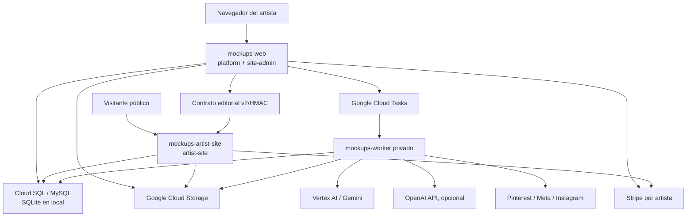

# Auditoría completa del proyecto Artwork Mockups

**Fecha de corte:** 2026-07-27  
**Repositorio auditado:** `C:\laragon\www\artworkmockups`  
**Rama y commit local:** `main` en `9df60d7932bef134f8cc185290365df33869c8b2`  
**Commit remoto observado:** `origin/main` en `46f9f9d7ef19b12f6b961b61239016f7890cded1`  
**Alcance:** código versionado, configuración, documentación, historial Git reciente, pruebas ejecutables y estado de los servicios Cloud Run. No se inspeccionaron valores de secretos ni contenido privado de producción.

> Este documento distingue entre **vigente** (confirmado por código/pruebas), **histórico** (documentación que describe una fase anterior), **experimental** (aislado por flag, LAB o proveedor preview) y **pendiente** (deuda explícita o contrato que hoy falla). El código y las pruebas actuales tienen prioridad sobre los handoffs antiguos.

## Resumen ejecutivo

Artwork Mockups es hoy un monorepo PHP con tres superficies desplegables y una base de datos compartida:

1. `platform/`: aplicación autenticada, administración, pipeline de obra raíz y mockups, editorial bilingüe, publicación web/social, Video Studio y workers privados.
2. `site-admin/`: gestor operativo de sitio y tienda, incluido dentro de la imagen web de `platform/`.
3. `artist-site/`: sitio público multi-tenant de artista, desplegado como servicio Cloud Run independiente.

La arquitectura de producción ya no coincide con la descripción SQLite/Windows de los README antiguos: producción usa MySQL en Cloud SQL, Google Cloud Storage para medios persistentes, Cloud Tasks para trabajos asíncronos, dos servicios Cloud Run de aplicación (`mockups-web`, `mockups-worker`) y un tercer servicio público (`mockups-artist-site`). SQLite y lanzamiento CLI/Windows siguen siendo rutas locales y de compatibilidad.

El estado verificado al corte es:

- `platform/tests/run_regression_tests.php`: **1123 PASS, 0 FAIL**.
- Las 15 pruebas de `artist-site/tests/`: **todas pasan**.
- `site-admin/tests/site_manager_regression_test.php`: **falla** en el cuarto chequeo, al buscar etiquetas inglesas literales en un header que ahora usa `site_t(...)`; el resto de la suite no llega a ejecutarse.
- Cloud Run: `mockups-web-d20260727154206`, `mockups-worker-d20260727152601` y `mockups-artist-site-cb-aae3a1a-c878a57b` estaban Ready con **100% del tráfico**.
- El checkout local de `main` está cuatro commits por delante de `origin/main`; además hay artefactos no versionados en `output/`, `tmp/` y `platform/scripts/deploy_to_production.ps1`.

## 1. Estructura de archivos

### 1.1 Convenciones del árbol

El árbol exhaustivo aparece en el **Anexo A**. Incluye todos los archivos versionados por Git y todos los directorios derivados de esas rutas. Cada entrada tiene una descripción de una línea.

No se enumeran archivo por archivo:

- `.git/`: metadatos internos de Git.
- `.release/`: bundles y artefactos locales de release ignorados.
- `platform/vendor/` y `artist-site/vendor/`: dependencias Composer reconstruibles desde los lockfiles.
- `platform/analysis/`, `platform/jobs/`, `platform/results/`, `platform/uploads/`, `platform/logs/`, `platform/video/`: datos de runtime ignorados.
- `tmp/`, `output/`, `.codex-*`: trabajo temporal local, no canónico.

Sí se enumeran los archivos de medios que están versionados porque forman parte del artefacto fuente o de la muestra pública.

### 1.2 Topología resumida

```text
artworkmockups/
├── platform/       Aplicación principal, APIs, workers, dominio y pruebas
├── site-admin/     Gestor operativo incluido en la imagen de platform
├── artist-site/    Sitio público y contrato de sincronización editorial
├── design-system/  Constitución visual, patrones, referencias y auditorías
├── AGENTS.md       Reglas de trabajo y cierre obligatorio en producción
└── README.md       Gobierno del monorepo, CI/CD y esquema
```

Conteo versionado observado:

| Área | Archivos |
|---|---:|
| `platform/` | 594 |
| `artist-site/` | 158 |
| `design-system/` | 34 |
| `site-admin/` | 10 |
| raíz | 6 |
| **Total** | **803** |

Hay 530 archivos PHP, 64 JPG, 58 Markdown, 45 JSON, 17 CSS, 14 JavaScript, 14 PowerShell, 14 PNG y archivos auxiliares. Los binarios estáticos de `artist-site/` están gobernados por Git LFS; buena parte de los JPG de muestra de `platform/assets/showcase/` no lo está.

## 2. Arquitectura general

### 2.1 Vista de componentes y dependencias



### 2.2 Bootstrap y composición interna

`platform/app/bootstrap.php` es el punto de composición global. Carga `config.php`, Composer, soportes, servicios de dominio, proveedores, assistant, video y seguridad. En MySQL instala `DatabaseSessionHandler`; toda mutación web pasa luego por la verificación CSRF central de `RequestSecurity`.

El proyecto no usa un framework MVC. La convención real es:

- archivos PHP en la raíz de `platform/` como controladores/páginas;
- clases de dominio y utilidades en `app/Support/`;
- casos de uso e integraciones en `app/Services/`;
- contratos de proveedores en `app/Contracts/`;
- subsistema de video en `app/Video/`;
- composición de proveedores en `ServiceFactory`;
- migraciones aditivas e inmutables en `migrations/schema/`;
- pruebas de regresión mayormente contractuales y de inspección de código.

`artist-site/index.php` funciona como front controller del sitio público. Resuelve tenant por host/email, carga catálogos publicados desde la base compartida y renderiza rutas localizadas. `site-admin/index.php` es una aplicación compacta de administración que depende de `platform/app/bootstrap.php` y `SiteManagerService`.

### 2.3 Persistencia y gobierno de esquema

`Database` admite:

- **Local:** SQLite en `platform/storage/app.sqlite`, WAL, foreign keys y migración automática.
- **Producción:** MySQL/Cloud SQL, sesiones persistidas en base y migraciones deshabilitadas durante tráfico normal.

`SchemaMigrator` aplica `platform/migrations/schema/*.php` en orden, registra versión y SHA-256 en `schema_migrations`, bloquea cambios a migraciones históricas y permite durante despliegue un solapamiento aditivo controlado. Cloud Build ejecuta el mismo artefacto inmutable como job `mockups-db-migrate` solo cuando cambia el directorio de esquema.

Hay migraciones anteriores fuera de `migrations/schema/` para Pinterest y el reemplazo inicial de Video Studio. Representan la etapa pre-gobernanza; el contrato vigente exige que todo cambio nuevo sea un archivo inmutable dentro de `migrations/schema/`.

### 2.4 Almacenamiento de medios

`StorageService` abstrae disco local y GCS. En producción, originales, obras raíz, mockups, referencias, videos y medios editoriales deben persistir en el bucket configurado. Los directorios de runtime están excluidos de Git y del contexto de despliegue. El sitio público consume medios mediante endpoints autorizados de Artwork Mockups y no es dueño de las cargas históricas.

Las imágenes estáticas del sitio público sí son fuente y usan Git LFS. El índice `platform/storage/world_mothers/index.json` es la única pieza versionada del catálogo runtime de mundos madre; las imágenes se sincronizan a GCS.

### 2.5 Pipeline de obra raíz

Flujo vigente:

1. `artwork_new.php` crea la obra y recoge medidas/serie.
2. La obra puede generarse desde una foto o importarse como raíz final mediante `upload_existing_root.php`.
3. `root_worker.php`/`GeminiArtworkProcessor`, `OpenAIArtworkProcessor` o `MockArtworkProcessor` preparan una raíz frontal fiel.
4. `root_select.php` y `select_root.php` consolidan la raíz elegida.
5. Las vistas raíz adicionales se guardan en almacenamiento persistente.
6. El registro canónico queda en base y alimenta Series, editorial, escenas, mockups y publicación.

Los procesadores implementan `ArtworkProcessorInterface`. `ServiceFactory` selecciona mock, Gemini o OpenAI según `APP_MODE`, `ALLOW_REAL_API`, `IMAGE_PROVIDER` y las credenciales.

### 2.6 Pipeline vigente de escenas y mockups

El flujo vivo parte de Scene Studio y de combinaciones, no del antiguo CORE JSON:

1. `create_scenes.php` y `world_mother_studio.php` administran mundos/escenas y referencias.
2. `MockupContextWorldRegistry`, `WorldMotherLibrary`, `SceneRankingService` y `SceneReferenceDiversityService` seleccionan material y evitan repetición inmediata.
3. `CameraSlotStudio` y los archivos `app/Config/mockup_camera_*` definen slots, geometría, familias de contexto y variantes.
4. `MockupCombinationEngine` compone las combinaciones de mundo, cámara y obra.
5. `MockupGenerationDispatcher` crea trabajo asíncrono; localmente puede usar procesos CLI y en GCP usa Cloud Tasks.
6. `MockupGenerationWorker` reclama el trabajo y llama a `GeminiMockupGenerator`, `OpenAIMockupGenerator` o mock.
7. `GeminiImageClient` y `vertex_bridge.py` preparan referencias, prompt y llamada a Vertex/Gemini.
8. `FidelityValidatingMockupGenerator` envuelve el generador y `ArtworkFidelityGate` revisa semejanza, con hasta dos regeneraciones configurables.
9. El resultado se persiste, se indexa en fichas y se expone en `mockup_combination_results.php`, álbum, Series y editorial.

El pipeline antiguo basado en `analysis/core/*.core.json`, branches, drafts y `report.php` está conservado como código histórico pero bloqueado por `LEGACY_MOCKUP_FLOW_ENABLED=false`. La auditoría de prompts del 2026-07-01 documenta que ese flujo tenía capas que escribían `mockup_contexts` sin influir en la generación final. No debe considerarse autoridad actual.

### 2.7 Pipeline editorial bilingüe

La decisión central es **español como master editorial** e inglés internacional como adaptación derivada:

- `ArtworkAnalysisV2Service` produce análisis español estructurado.
- `BilingualEditorialService` normaliza y valida paquetes para artwork, mockup, series y Studio Notes.
- `BilingualEditorialJobService` persiste trabajos.
- `BilingualEditorialGenerationWorker` los ejecuta fuera del web interactivo.
- `EditorialIntegrityPolicy` impide afirmaciones comerciales, de prestigio o inversión no sustentadas.
- `ArtworkEditorialPackageService` prepara una obra y sus mockups como unidad.
- `SeriesKeywordResearchService` importa investigación de Keyword Planner separada por idioma/mercado.
- Los snapshots publicados quedan separados de los borradores; editar el master no cambia silenciosamente lo ya publicado.

Studio Notes tiene además `StudioNoteWorkspaceService`, `StudioNoteMediaService`, `StudioNoteChangeClassifier` y `StudioNoteMarkdownImportService`. Puede importar un ZIP bilingüe completo sin IA, conservar imágenes en posición, decidir si hace falta reanálisis/adaptación y publicar el lote de forma atómica.

### 2.8 Publicación de website y sitio público

`WebsiteBoardService`, `PublicationService` y `ArtworkWebsiteV2Service` controlan publicaciones. El contrato privado usa endpoint y secreto HMAC compartido; `ArtworkWebsiteDryRunService` valida antes de publicar.

La propiedad de datos definida es:

- Artwork Mockups: artista canónico, obras, raíces, mockups, series y contenido editorial.
- Site Manager: visibilidad pública, dominio, precios, stock, shipping, credenciales Stripe, pedidos y actividad.
- Artist Site: superficie de lectura/checkout; no edita el contenido canónico.

`artist-site` puede leer directamente la misma base de producción y mantiene además repositorios/contratos v2 para sincronización y despliegues SFTP históricos. El sitio resuelve tenants, rutas ES/EN, slugs canónicos, sitemap, contacto, series, artworks, Studio Notes, Constellations y tienda.

### 2.9 Comercio

Cada artista conecta directamente su propia cuenta Stripe:

- no se usa Stripe Connect ni OAuth de plataforma;
- secret key y webhook signing secret se cifran con `STRIPE_CREDENTIALS_KEY` usando `sodium_crypto_secretbox`;
- el checkout se crea con la credencial del artista;
- el stock se reserva transaccionalmente y se consume o libera al completar/cancelar;
- shipping se calcula por continente;
- el webhook compartido resuelve la credencial por artista y mantiene aislamiento multi-tenant.

### 2.10 Social

El tablero social toma contenido de las fichas bilingües y conserva versiones por idioma:

- Pinterest: OAuth, boards, drafts, recorte 2:3, lotes, publicación y scheduler.
- Meta/Facebook: OAuth separado por propósito `artist`/`platform`, drafts, lotes y publicación.
- Instagram: Direct Instagram Login para cuentas profesionales, drafts y publicación.
- `SocialBoardPublishService` valida destinos y flags antes de encolar.
- `SocialPublishJobService` persiste trabajos; `social_publish_worker.php` los ejecuta.
- `SocialScheduledPublicationService` gestiona la agenda.

No hay publicación automática: cada entrega requiere revisión/confirmación. Pinterest está actualmente en Sandbox mientras se revisa Standard access. Meta e Instagram permanecen detrás de flags de OAuth, media pública y live publish.

### 2.11 Video

`app/Video/` es un subsistema separado:

- `VideoStudioRepository` y `VideoStudioSchema`: persistencia.
- `VideoStudioService`: proyectos, secuencias y referencias.
- `VideoPromptComposer` y `VideoReferencePolicy`: contratos de prompt/referencias.
- `VideoProviderRegistry`: selección entre Gemini Omni preview y Veo.
- `VideoGenerationService` y `VideoTaskDispatcher`: generación asíncrona.
- `VideoExportBuilder`, `VideoExportService` y `VideoFfmpeg`: composición/exportación.
- `VideoEditorService`: edición por instrucción.
- `VideoFinalUploadService`: carga de video final.

Los endpoints raíz `video_*` son controladores web/worker. La publicación de un video final por obra ya está integrada en el sitio público. FFmpeg solo está presente en la imagen worker.

### 2.12 Assistant

`app/Assistant/` implementa un assistant privado con configuración, repositorio, contexto, vista y cliente OpenAI. Tiene persistencia, rate limit y controles de acceso separados para admin/app. Está desactivado por defecto (`ASSISTANT_ENABLED=false`) y puede usar OpenAI o una ruta Gemini configurada.

### 2.13 Despliegue

El monorepo usa triggers por rutas en `main`:

- cambios `platform/` o `site-admin/` → `platform/cloudbuild.ci.yaml`;
- cambios `artist-site/` → `artist-site/cloudbuild.hardening.yaml`;
- documentación/diseño sin código no despliega servicios.

El pipeline de aplicación construye imágenes inmutables web/worker, ejecuta regresión, publica en Artifact Registry, migra esquema si corresponde, despliega sin tráfico, verifica y recién entonces mueve 100%. El worker es privado por IAM; web es público. El pipeline de artist site hace smoke test de candidato sin tráfico y promoción posterior.

## 3. Decisiones de diseño y arquitectura tomadas

### 3.1 Decisiones vigentes confirmadas

1. **Monorepo con tres superficies.** `platform`, `site-admin` y `artist-site` comparten contratos, pero tienen responsabilidades visuales y de despliegue distintas.
2. **Artwork Mockups es un estudio, no un dashboard.** La interfaz se concibe como mesas de trabajo verticales, visuales y directas.
3. **La obra es protagonista.** Imágenes antes que tablas, boards antes que listas, acciones locales sobre thumbnails y controles secundarios discretos.
4. **Componentes visuales canónicos.** Decision Block cuadrado para compromisos principales, Thumbnail Card rectangular, Glass Action sobre la imagen, Workspace Panel, Carousel, Drop Zone, Toolbar, Badge y Counter.
5. **Continuidad visual antes que novedad.** Toda UI debe usar referencias y Master Patterns existentes; no se crea una dirección nueva porque aparezca una funcionalidad.
6. **Paleta pastel y baja saturación.** Sin Material/Bootstrap Admin, dashboards KPI, gradientes decorativos, glassmorphism exagerado, sombras fuertes o texto diminuto.
7. **Flujo vertical con navegación horizontal interna.** Header → decisión → carrusel → workspace → asignaciones → resultados.
8. **Drag antes que formularios.** Mover, ordenar, agrupar y asignar material visual se resuelve por manipulación directa, con alternativa accesible.
9. **Español como fuente editorial.** El inglés internacional es una adaptación revisable ligada por hash al master español.
10. **Un título universal y slugs canónicos.** El título de obra/serie se mantiene una sola vez; rutas públicas ES/EN comparten identidad semántica.
11. **Borrador y snapshot publicado separados.** Cambios privados nunca alteran silenciosamente contenido publicado.
12. **IA fuera del request interactivo.** Generación de imágenes, editorial, social y video usa workers/tareas persistentes.
13. **Medios persistentes fuera del repo.** GCS en producción; Git LFS solo para assets estáticos fuente del sitio.
14. **Esquema aditivo e inmutable.** Migraciones versionadas por checksum; producción falla cerrada ante divergencia.
15. **Separación estricta local/producción.** `APP_ENV=local` rechaza bases sin `local`; producción rechaza bases locales.
16. **Proveedores intercambiables.** Interfaces y factory permiten mock, Gemini/Vertex y OpenAI.
17. **Fidelidad como gate, no solo prompt.** El resultado generado se revisa y puede regenerarse antes de aceptarse.
18. **Mundo madre como evidencia/inspiración, no layout literal.** Cámara y prompt reconstruyen la escena; no copian la referencia.
19. **Prevención de repetición.** Ranking, huellas y diversidad excluyen material del artwork inmediatamente anterior y favorecen variedad.
20. **Publicación siempre explícita.** Social y website requieren decisión humana; no se publica automáticamente.
21. **Credenciales por tenant.** Pinterest/Meta/Instagram/Stripe separan propósito y artista; los secretos se cifran o vienen de Secret Manager.
22. **Stripe directo por artista.** No existe cuenta Stripe central ni Connect; cada artista cobra con su propia cuenta.
23. **Dominio custom fail-closed.** Un dominio no se activa hasta verificar TXT; hosts desconocidos no resuelven al tenant equivocado.
24. **Deploy inmutable y gradual.** Candidato sin tráfico, pruebas, promoción al 100%, revisión asociada a commit.
25. **Trabajos recuperables.** La navegación no cancela generación; jobs persistentes pueden recuperarse y reintentarse con límites.

### 3.2 Convenciones de nombres

- Clases: PascalCase, generalmente sufijadas `Service`, `Repository`, `Publisher`, `Client`, `Policy`, `Registry`, `Worker` o `Schema`.
- Endpoints/páginas: snake_case en archivos PHP de raíz.
- Variables de entorno y flags: SCREAMING_SNAKE_CASE.
- Migraciones: `YYYYMMDD_NNNNNN_descripcion.php`.
- Slugs públicos: minúsculas, ASCII, guiones; identidad universal compartida entre idiomas.
- Medios SEO de mockups: cámara/contexto antes que artista; se evita incluir el nombre del artista.
- Servicios Cloud Run: `mockups-web`, `mockups-worker`, `mockups-artist-site`.
- Jobs/task queues: generación, editorial, social y video separados lógicamente, con posibilidad de reutilizar cola mediante configuración.

### 3.3 Decisiones históricas que ya no son autoridad

- El nombre “The Artwork Curator” y el flujo CORE JSON 1.1 de `CURRENT_PROJECT_STATUS.md` describen una fase congelada/legacy, no toda la plataforma actual.
- `platform/README.md` e `INSTRUCCIONES_CODEX.md` describen SQLite, WMIC y un motor de escala previo. Son útiles para entender el origen, pero producción usa Cloud SQL/Cloud Tasks y el pipeline de combinaciones.
- Admin V7 y el prompt passthrough fueron una etapa de auditoría. Los endpoints relacionados están detrás de `LEGACY_MOCKUP_FLOW_ENABLED`.
- La “nueva plataforma ArtworkMockups + Artist Sites” es una especificación de migración amplia; partes importantes ya se implementaron, pero no debe leerse como estado de ejecución.
- El admin embebido antiguo de `artist-site/index.php`, `admin-v2/` y scripts de migración/SFTP coexiste con el Site Manager actual y es material de transición.

## 4. Estado actual de cada funcionalidad

| Funcionalidad | Estado | Evidencia y límites |
|---|---|---|
| Registro, login, reset y sesiones | Terminado | Rate limit, invalidación de sesiones, registro público gateado y CSRF central cubiertos por regresión. |
| Roles, planes y feature access | Terminado | `FeatureAccess` y migración de gobierno de acceso; overrides por usuario y flags globales. |
| Perfil de artista | Terminado | Identidad, foto, materiales, conexiones y dominio; edición canónica en platform. |
| Creación/subida de obra | Terminado | Creación dentro de Series, dimensiones obligatorias e importación de raíz final. |
| Generación de obra raíz | Terminado | Proveedores mock/Gemini/OpenAI, trabajo en background y almacenamiento persistente. |
| Selección y vistas de raíz | Terminado | Flujo unificado, cuatro vistas/progreso, reparación de referencias rotas. |
| Series y orden editorial | Terminado | Asignación, drag/drop, covers, orden de series/obras, contenido bilingüe. |
| Agrupación/fusión de obras | Terminado | Auditoría, propuestas y merge transaccional con actualización editorial. |
| Scene Studio / mundos madre | Terminado operativo | Biblioteca, categorías, favoritos, ranking, referencias y sincronización GCS. |
| LAB de variaciones de mundo madre | Experimental | Rutas `world_mother_variation_lab*` y herramienta Imagen inpainting aisladas de producción principal. |
| Camera Studio / slots | Terminado | Contratos y snapshot de 14 slots activos protegidos por regresión. |
| Generación de mockups por combinaciones | Terminado | Dispatcher/worker, progreso global, batches compactos, favoritos, regeneración y borrado. |
| Fidelity gate | Terminado, configurable | Activo por defecto; umbral y regeneraciones por env. Calidad real depende del modelo. |
| Flujo CORE/branches/Admin V7 | Legacy desactivado | Conservado por compatibilidad/auditoría; `LEGACY_MOCKUP_FLOW_ENABLED=false`. |
| Álbum e importación de mockups externos | Terminado | Importación, ownership, favoritos, descarga y edición sobre thumbnails. |
| Análisis editorial de artwork/mockup | Terminado | Esquema v2, español primero, políticas de integridad y reparación de salidas incompletas. |
| Editorial bilingüe | Terminado | Jobs persistentes, worker privado, snapshots y adaptación EN ligada al master ES. |
| Keyword research de Series | Terminado | Importación por idioma/mercado y selección separada de métricas publicitarias. |
| Studio Notes | Terminado y activamente evolucionado | Board, WYSIWYG, imágenes persistentes, clasificación de cambios, publicación atómica. |
| Importación ZIP Markdown bilingüe | Terminado | Importa sin IA, valida alineación ES/EN y relaciones externas. |
| Publicación de artworks/series/mockups | Terminado | Website board y servicio v2; borrador/publicado separados. |
| Sitio público ES/EN | Terminado | Catálogo, artwork, series, Studio Notes, Artist, contacto, SEO, sitemap y móvil; 15 suites pasan. |
| Constellations | Terminado en modo país | Un país opcional por obra publicada; soporte histórico más rico aún existe en modelo/UI anterior. |
| Site Manager | Parcialmente terminado | Operaciones de contenido/tienda existen; la suite falla por contrato de navegación desactualizado y no completa los chequeos restantes. |
| Dominio personalizado | Backend terminado; operación pendiente | Canonización, token TXT y activación están probados; la UI aún dice que el provisioning DNS no está conectado. |
| Inbox de contacto multi-tenant | Parcial | Formulario público y repositorio existen; Site Manager declara pendiente migrar asignación tenant-safe antes de retirar inbox legacy. |
| SMTP de contacto | Terminado, dependiente de configuración | PHPMailer y pruebas; requiere credenciales/Secret Manager. |
| Stripe directo por artista | Terminado | Cifrado, verificación de cuenta, checkout, webhook, stock y órdenes probados. |
| Shipping por continente | Terminado | Tarifas persistentes en minor units; default actual 250 EUR por continente en Site Manager. |
| Pinterest | Sandbox operativo / producción pendiente de review | OAuth y publicación confirmada en Sandbox; Standard access aún en revisión. |
| Meta/Facebook | Implementado pero gateado | Cliente, OAuth, drafts, batches y worker; dominio/app/callback deben verificarse y flags habilitarse. |
| Instagram | Implementado pero gateado | Direct Login y publicación profesional; credenciales/callback y aprobación controlada pendientes. |
| Agenda social | Terminado a nivel de aplicación | Jobs y scheduler existen; ejecución real depende de flags/credenciales de cada red. |
| Video Studio | Terminado operativo | Proyectos, referencias, generación, edición, exportación y final por obra. |
| Gemini Omni video | Experimental | Modelo `gemini-omni-flash-preview`; sujeto a disponibilidad/cambios del proveedor. |
| Veo 3.1 | Integrado | Proveedor y modelo configurables; coste/cuota/credenciales externas. |
| Publicación de video final en artist site | Terminado | Una publicación final por obra en esquema y render público. |
| Assistant | Implementado, desactivado por defecto | Persistencia, contexto y rate limits; necesita provider y flag. |
| Preview de consistencia visual | Experimental y reversible | Solo scopes registrados, flag maestro y reviewers/admin; no es UI general activa. |
| CI/CD | Terminado | Builds por ruta, pruebas, imágenes inmutables, migración, canary sin tráfico y promoción. |
| Seguridad de producción | Terminado con cobertura amplia | Apache deny-by-default, IAM worker, CSP/frame policy, sanitización y tenant fail-closed. |

## 5. Problemas conocidos y deuda técnica

### 5.1 Hallazgos confirmados

1. **Suite de Site Manager roja.** `site-admin/tests/site_manager_regression_test.php` busca `>Artworks</a>` y etiquetas siguientes como literales. `artist-site/inc/header.php` usa localización dinámica, por lo que el test falla en “Public navigation places Artworks in order”. Es probable que sea deuda del test, pero hasta corregir el contrato no se verifican los chequeos posteriores de esa suite.
2. **`main` local por delante de remoto.** Hay cuatro commits locales de Pinterest Sandbox que no estaban en `origin/main` al corte. Cualquier push posterior puede publicar esos cuatro además de nueva documentación.
3. **Script de deploy no versionado.** `platform/scripts/deploy_to_production.ps1` existe localmente pero no está en Git; su autoridad y mantenimiento no están documentados.
4. **Artefactos temporales no versionados.** `output/` y `tmp/` contienen resultados de trabajo; deben permanecer fuera del repositorio canónico.
5. **Documentación contradictoria.** README/handoffs antiguos describen SQLite, WMIC, CORE JSON y fases Admin V7 como si fueran arquitectura principal. El README raíz y el código son más actuales.
6. **Código legacy de mockups aún presente.** `report.php`, branches, prompt drafts y endpoints relacionados siguen ocupando superficie y documentación aunque estén gateados. Aumentan costo cognitivo y riesgo de reactivación accidental.
7. **Admin histórico del artist site aún presente.** `admin-v2/`, scripts `create_*`, `move_admin.php`, `update_functions.php`, `run_migration_*`, `check_*` y archivos marcados “Deleted temporary…” son residuos claros de migración.
8. **Migraciones divididas.** Existen migraciones pre-gobernanza en `platform/migrations/` y las vigentes en `platform/migrations/schema/`. Es correcto históricamente, pero debe quedar claro que solo `schema/` acepta cambios nuevos.
9. **DNS operativo incompleto.** El dominio se modela y verifica, pero Site Manager aún muestra “Domain verification remains pending until DNS provisioning is connected”.
10. **Inbox tenant-safe pendiente.** La UI declara que la asignación segura de mensajes debe migrarse antes de retirar el inbox legacy.
11. **Pinterest no tiene aún Standard access.** El camino real está limitado al Sandbox; hay fallback tokens temporales (`PINTEREST_SANDBOX_TOKEN`, `PINTEREST_PRODUCTION_READ_TOKEN`) que deben retirarse cuando el OAuth definitivo esté aprobado.
12. **Meta/Instagram no validados end-to-end en producción.** El código existe, pero flags deben permanecer apagados hasta verificar app domains, callbacks, scopes, cuenta profesional y publicación controlada.
13. **Proveedor de video preview.** Gemini Omni usa un modelo preview; el contrato puede cambiar y no debe ser la única vía crítica sin fallback.
14. **Dependencia de CDN en UI.** Quill, Leaflet y Google Fonts se cargan desde terceros; caídas/CSP/offline afectan edición, mapa o tipografía.
15. **Assets de showcase pesados.** Hay muchos JPG/PNG de 1–5 MB en `platform/assets/showcase/`, varios fuera de LFS. Incrementan clon, build context y tamaño de imagen.
16. **Duplicado de retrato.** `artist-site/assets/images/maurizio-valch-portrait.jpg` y `.jpg.jpg` coexisten; puede ser intencional/histórico, pero merece normalización.
17. **`.env.example` incompleto respecto del código.** El código reconoce aproximadamente 138 claves, incluidas `DB_SOCKET`, `FFMPEG_BINARY_PATH`, `APP_RELEASE_COMMIT`, `PUBLIC_REGISTRATION_ENABLED` y varias de sincronización que no están todas explicadas en un único contrato.
18. **Configuración repetida.** `FEATURE_*` y `ARTWORK_SYNC_SHARED_SECRET` aparecen duplicados en ejemplos/composición; no rompe dotenv, pero dificulta auditar cuál comentario es autoridad.
19. **Versiones PHP distintas.** Local corre PHP 8.3.30; contenedores fijan PHP 8.2.32 aunque Composer declara `>=8.1`. Debe probarse conscientemente cualquier uso de sintaxis/extensiones 8.3.
20. **Pruebas contractuales muy acopladas a strings.** Gran parte de la regresión inspecciona HTML/código fuente. Detecta cambios de contrato, pero puede fallar por refactors equivalentes y no reemplaza pruebas HTTP/browser/end-to-end.
21. **No se ejecutaron pruebas de integración con APIs reales.** La auditoría no consumió Gemini/OpenAI/Stripe/social ni generó imágenes/video; el estado “terminado” se refiere a código y suites locales.

### 5.2 Riesgos de seguridad/operación a vigilar

- Nunca exponer endpoints worker en el servicio web; Apache e IAM hoy lo impiden.
- Mantener `PUBLIC_REGISTRATION_ENABLED=false` en producción.
- No permitir `APP_ALLOW_SCHEMA_MIGRATIONS=true` salvo en el job dedicado.
- Mantener claves de cifrado y passwords en Secret Manager; una rotación de `STRIPE_CREDENTIALS_KEY`, `META_TOKEN_KEY`, `INSTAGRAM_TOKEN_KEY` o `PINTEREST_TOKEN_KEY` requiere estrategia para re-cifrar datos existentes.
- No activar media pública temporal sin live-publish y confirmación controlada.
- Verificar que URLs de draft expiren y no entren en logs.
- Conservar el límite de reintentos de Cloud Tasks para evitar tormentas/coste.
- Mantener aislamiento de tenant en todos los endpoints de medios y queries por `user_id`.

### 5.3 TODOs implícitos prioritarios

1. Alinear y completar la suite `site-admin`.
2. Consolidar la documentación actual y marcar explícitamente los handoffs legacy.
3. Decidir retiro definitivo del flujo CORE/Admin V7 y de los scripts temporales del artist site.
4. Conectar verificación/provisioning DNS operacional.
5. Completar inbox multi-tenant.
6. Cerrar revisión Pinterest Standard y retirar fallbacks temporales.
7. Ejecutar pruebas controladas end-to-end de Meta e Instagram antes de habilitar flags.
8. Formalizar un manifiesto único de variables de entorno por servicio.
9. Mover/comprimir assets pesados de showcase o incorporarlos a una estrategia de objetos/LFS.
10. Añadir smoke/e2e de navegador para los flujos principales, además de los contratos de strings.

## 6. Dependencias externas

### 6.1 Dependencias PHP

`platform/composer.json`:

| Paquete | Versión | Uso |
|---|---|---|
| PHP | `>=8.1` | Runtime; imágenes usan 8.2.32, local 8.3.30. |
| `google/cloud-storage` | `^1.42` | GCS y medios persistentes. |
| `google/cloud-tasks` | `^1.11` | Dispatch asíncrono con OIDC. |
| `phpmailer/phpmailer` | `^6.10` | Email SMTP/contacto/reset. |
| `stripe/stripe-php` | `^19.0` | Checkout/webhooks por artista. |
| `symfony/yaml` | `>=6.4.42 <7.0` | Configuración YAML. |
| `league/commonmark` | `>=2.8.3 <3.0` | Importación/normalización Markdown. |

`artist-site/composer.json`:

| Paquete | Versión | Uso |
|---|---|---|
| PHP | `>=8.1` | Runtime público. |
| `phpmailer/phpmailer` | `^6.10` | Contacto. |
| `stripe/stripe-php` | `^19.4` | Checkout y webhooks. |

### 6.2 Dependencias de sistema y Python

- Apache 2 con `rewrite` y `headers`.
- Extensiones PHP de plataforma: `curl`, `zip`, `pdo_mysql`, `bcmath`, `mbstring`, `gd`; local también usa `pdo_sqlite`.
- Extensiones/funciones requeridas por código: `fileinfo`, `sodium`, `ZipArchive`, GD, cURL, mbstring y PDO.
- Worker: FFmpeg.
- Python 3 con `google-genai==2.12.1` y `Pillow==12.3.0`; el SDK aporta `httpx`/Google Auth como dependencias transitivas.
- Herramienta SFTP histórica: Python `paramiko` en un venv local ignorado.
- Composer 2.10.2 en platform; Composer 2.9.4 como etapa del artist-site.

### 6.3 APIs y servicios

| Servicio | Uso | Estado |
|---|---|---|
| Vertex AI / Gemini Image | Obra raíz, mockups, fidelity/análisis y worlds | Activo cuando se habilita API real. |
| Vertex Gemini Omni | Video multimodal/edición | Preview/experimental. |
| Vertex Veo 3.1 | Generación de video | Integrado. |
| OpenAI Images/Responses | Proveedor alternativo y assistant | Opcional/gateado. |
| Google Cloud Storage | Medios persistentes | Producción. |
| Google Cloud Tasks | Generación/editorial/social/video | Producción. |
| Cloud SQL MySQL | Persistencia compartida | Producción. |
| Cloud Run | Web, worker y artist site | Producción. |
| Artifact Registry/Cloud Build | CI/CD e imágenes | Producción. |
| Secret Manager | Passwords y claves | Producción. |
| Stripe | Checkout, webhooks, órdenes | Por artista. |
| Pinterest API v5 | OAuth, boards y Pins | Sandbox; Standard review pendiente. |
| Meta Graph API v25.0 | Facebook Pages | Implementado, gateado. |
| Instagram Graph/Direct Login v25.0 | Publicación profesional | Implementado, gateado. |
| SMTP | Contacto/reset | Configurable. |
| DNS TXT | Verificación de dominios | Backend implementado; operación pendiente. |
| Google Fonts | Tipografía | CDN. |
| Quill 2.0.2 | Editor Studio Notes | jsDelivr. |
| Leaflet 1.9.4 + CARTO tiles | Mapas/Constellations | CDN/tiles externos. |
| Google Analytics | Medición del artist site | ID presente en frontend. |

### 6.4 Variables de entorno

La siguiente clasificación reúne las claves observadas en código, ejemplos y deploy. Las claves que contienen secretos deben almacenarse fuera de Git.

#### Runtime y acceso

- `APP_ENV`: `local` o `production`.
- `APP_MODE`: `mock`, `gemini` u `openai`.
- `ALLOW_REAL_API`: permite consumo real.
- `APP_BASE_PATH`, `APP_URL`, `APP_PUBLIC_URL`, `ARTWORKMOCKUPS_PUBLIC_URL`: bases de URL.
- `APP_RELEASE_COMMIT`: commit inmutable de la revisión.
- `PUBLIC_REGISTRATION_ENABLED`: registro público.
- `ADMIN_EMAILS`: administradores.
- `FEATURE_WEBSITE_ENABLED`, `FEATURE_SOCIAL_ENABLED`, `FEATURE_VIDEO_ENABLED`: rollout de módulos.
- `UI_VISUAL_CONSISTENCY_PREVIEW`, `UI_VISUAL_CONSISTENCY_PREVIEW_REVIEWERS`: preview visual.

#### Base de datos

- `DB_CONNECTION`: `sqlite` o `mysql`.
- `DB_HOST`, `DB_PORT`, `DB_SOCKET`, `DB_DATABASE`, `DB_USERNAME`, `DB_PASSWORD`, `DB_CHARSET`.
- `APP_ALLOW_SCHEMA_MIGRATIONS`: solo job de migración.
- `TARGET_DB_PASSWORD`: scripts de migración.

#### Imagen y mockups

- `IMAGE_PROVIDER`, `GEMINI_API_KEY`, `GEMINI_IMAGE_MODEL`.
- `VERTEX_PROJECT_ID`, `VERTEX_LOCATION`, `GOOGLE_OAUTH_ACCESS_TOKEN`.
- `OPENAI_API_KEY`, `OPENAI_IMAGE_MODEL`, `OPENAI_ANALYSIS_MODEL`, `OPENAI_IMAGE_QUALITY`, `OPENAI_IMAGE_SIZE`, `OPENAI_API_BASE`.
- `PHP_BINARY_PATH`, `PYTHON_BINARY_PATH`, `MOCKUP_WORKER_COUNT`.
- `MOCKUP_PROMPT_FIRST_MODE`, `MOCKUP_PROMPT_FIRST_NO_MASK_MODE`, `MOCKUP_USE_PRECOMPOSITION`, `MOCKUP_USE_BACKGROUND_EDIT`, `MOCKUP_SCALE_CAMARA_15`.
- `LEGACY_MOCKUP_FLOW_ENABLED`.
- `MOCKUP_FIDELITY_GATE_ENABLED`, `MOCKUP_FIDELITY_FAIL_OPEN`, `MOCKUP_FIDELITY_MAX_REGENERATIONS`, `MOCKUP_FIDELITY_MIN_SCORE`, `MOCKUP_FIDELITY_REVIEW_MODEL`.

#### Google Cloud

- `GCP_PROJECT_ID`, `GCP_LOCATION`, `GCS_BUCKET_NAME`.
- `GCP_QUEUE_NAME`, `GCP_SOCIAL_QUEUE_NAME`, `GCP_VIDEO_QUEUE_NAME`.
- `GCP_WORKER_URL`, `GCP_EDITORIAL_WORKER_URL`, `GCP_TASKS_INVOKER_SA`.
- `EDITORIAL_WORKER_TOKEN`, `VIDEO_WORKER_TOKEN`.
- `K_SERVICE`: inyectada por Cloud Run.

#### Video

- `FFMPEG_BINARY_PATH`.
- `VIDEO_VERTEX_PROJECT_ID`, `VIDEO_VERTEX_LOCATION`.
- `VIDEO_GENERATION_PROVIDER`, `VIDEO_OMNI_MODEL`, `VIDEO_VEO_MODEL`, `VIDEO_VEO_RESOLUTION`.
- `VIDEO_DISABLE_BACKGROUND_JOBS`.

#### Assistant

- `ASSISTANT_ENABLED`, `ASSISTANT_ADMIN_ENABLED`, `ASSISTANT_APP_ENABLED`, `ASSISTANT_ALLOWED_EMAILS`.
- `ASSISTANT_PROVIDER`, `OPENAI_ASSISTANT_MODEL`.
- `ASSISTANT_VERTEX_PROJECT_ID`, `ASSISTANT_VERTEX_LOCATION`, `ASSISTANT_GOOGLE_APPLICATION_CREDENTIALS`.
- `ASSISTANT_MAX_OUTPUT_TOKENS`, `ASSISTANT_HISTORY_MESSAGES`, `ASSISTANT_RATE_LIMIT_PER_MINUTE`, `ASSISTANT_DAILY_MESSAGE_LIMIT`.

#### Artist site y sincronización

- `ACTIVE_ARTIST_EMAIL`, `ARTIST_SITE_PUBLIC_URL`, `ARTIST_SITE_DOMAIN_TARGET`, `ARTIST_ADMIN_URL`.
- `ARTIST_CATALOG_V2_ROOT`, `ARTIST_WEBSITE_CATALOG_URL`.
- `ARTWORK_WEBSITE_V2_ENDPOINT`, `ARTWORK_WEBSITE_SYNC_ENDPOINT`, `ARTWORK_WEBSITE_PUBLISH_ENDPOINT`.
- `ARTWORK_SYNC_SHARED_SECRET`, `ARTWORK_SYNC_DRAFT_FILE`, `ARTWORK_SYNC_SOURCE_DIR`.
- `EDITORIAL_SYNC_TARGET_HOST`, `EDITORIAL_SYNC_TARGET_PORT`, `EDITORIAL_SYNC_TARGET_DATABASE`, `EDITORIAL_SYNC_TARGET_USERNAME`, `EDITORIAL_SYNC_TARGET_PASSWORD`.
- SFTP local: `ARTIST_SITE_SFTP_HOST`, `ARTIST_SITE_SFTP_PORT`, `ARTIST_SITE_SFTP_USER`, `ARTIST_SITE_SFTP_PASSWORD`, `ARTIST_SITE_SFTP_ROOT`.

#### Comercio

- `STRIPE_CREDENTIALS_KEY`: clave Base64 de 32 bytes para cifrado.

#### Pinterest

- `PINTEREST_APP_ID`, `PINTEREST_APP_SECRET`, `PINTEREST_REDIRECT_URI`, `PINTEREST_TOKEN_KEY`.
- `PINTEREST_API_ENVIRONMENT`: `production` o `sandbox`.
- `PINTEREST_LIVE_PUBLISH_ENABLED`, `PINTEREST_DRAFT_PUBLIC_MEDIA_ENABLED`.
- `PINTEREST_SANDBOX_TOKEN`: fallback temporal.
- `PINTEREST_PRODUCTION_READ_TOKEN`, `PINTEREST_PRODUCTION_READ_USER_ID`: puente read-only temporal.

#### Meta e Instagram

- Meta: `META_GRAPH_VERSION`, `META_SCOPES`, `META_APP_ID_ARTIST`, `META_APP_SECRET_ARTIST`, `META_REDIRECT_URI_ARTIST`, equivalentes `_PLATFORM`, `META_TOKEN_KEY`, `META_OAUTH_ENABLED`, `META_LIVE_PUBLISH_ENABLED`, `META_DRAFT_PUBLIC_MEDIA_ENABLED`.
- Instagram: `INSTAGRAM_GRAPH_VERSION`, `INSTAGRAM_SCOPES`, `INSTAGRAM_APP_ID_ARTIST`, `INSTAGRAM_APP_SECRET_ARTIST`, `INSTAGRAM_REDIRECT_URI_ARTIST`, `INSTAGRAM_TOKEN_KEY`, `INSTAGRAM_OAUTH_ENABLED`, `INSTAGRAM_LIVE_PUBLISH_ENABLED`, `INSTAGRAM_DRAFT_PUBLIC_MEDIA_ENABLED`.

#### Contacto y enlaces externos

- `CONTACT_RECIPIENT_EMAIL`, `CONTACT_FROM_EMAIL`, `MAIL_FROM`.
- `SMTP_HOST`, `SMTP_PORT`, `SMTP_ENCRYPTION`, `SMTP_USERNAME`, `SMTP_PASSWORD`.
- `ARTIST_WEBSITE_CATALOG_URL`, `SAATCHI_ARTIST_URL`.
- `PASSWORD_RESET_DEBUG_LINK`: solo diagnóstico local, nunca producción.

### 6.5 Configuración de producción observada

Sin leer secretos, la infraestructura observada fue:

| Servicio | Revisión Ready | Tráfico | Identidad | Escala máxima |
|---|---|---:|---|---:|
| `mockups-web` | `mockups-web-d20260727154206` | 100% | `mockups-web-sa@…` | 10; mínimo 1 |
| `mockups-worker` | `mockups-worker-d20260727152601` | 100% | `mockups-worker-sa@…` | 4 |
| `mockups-artist-site` | `mockups-artist-site-cb-aae3a1a-c878a57b` | 100% | `artist-site-sa@…` | 3 |

Los tres usan la instancia Cloud SQL `mockups-mysql` en `us-central1`.

## 7. Verificación realizada

Comandos y resultados:

```text
php -v
→ PHP 8.3.30 local

php platform/tests/run_regression_tests.php
→ PASS 1123 | FAIL 0

artist-site/tests/*_test.php
→ 15 suites PASS

php site-admin/tests/site_manager_regression_test.php
→ 3 checks PASS; fatal en “Public navigation places Artworks in order”

gcloud run services describe ...
→ tres revisiones Ready, 100% del tráfico
```

No se modificó lógica de aplicación ni se ejecutaron mutaciones sobre producción durante la auditoría.

## Anexo A. Árbol exhaustivo versionado

> Las descripciones de archivos repetitivos se generan por su rol y convención de nombre. “Endpoint/página” significa un controlador PHP directamente enrutable; “servicio” significa una clase cargada por bootstrap o autoload; “asset” significa material estático incluido en el artefacto.

- `.dockerignore` — Exclusiones del contexto Docker.
- `.gcloudignore` — Exclusiones al enviar fuentes a Google Cloud Build.
- `.gitattributes` — Reglas Git y asignación de binarios a Git LFS.
- `.gitignore` — Exclusiones de credenciales, dependencias y datos de runtime.
- `AGENTS.md` — Reglas obligatorias de trabajo, UI y cierre en producción.
- `artist-site/` — Sitio público multi-tenant, catálogo editorial, checkout y contratos de sincronización.
  - `.dockerignore` — Exclusiones del contexto Docker.
  - `.env.example` — Contrato de variables de entorno sin secretos.
  - `.gcloudignore` — Exclusiones al enviar fuentes a Google Cloud Build.
  - `.gcloudignore.hardening` — Archivo de soporte: .Gcloudignore.
  - `.gitignore` — Exclusiones de credenciales, dependencias y datos de runtime.
  - `.htaccess` — Reglas Apache de routing o protección local.
  - `admin-v2/` — Admin histórico del sitio público.
    - `admin-v2.css` — Estilos de Admin V2.
    - `index.php` — Front controller o página índice del área.
  - `AGENTS.md` — Reglas obligatorias de trabajo, UI y cierre en producción.
  - `api/` — Endpoints de sincronización del sitio público.
    - `artworks/` — Endpoints y datos por obra.
      - `publish.php` — Endpoint público/API: Publish.
      - `sync.php` — Endpoint público/API: Sync.
    - `v2/` — Versión 2 de un contrato o endpoint.
      - `artworks/` — Endpoints y datos por obra.
        - `sync.php` — Endpoint público/API: Sync.
  - `artworks/` — Endpoints y datos por obra.
    - `Calma y Tranquilidad-Strata Origin-120x80x5-Bélgica-2025.jpg` — Fotografía fuente versionada de artwork: Calma Y Tranquilidad Strata Origin 120x80x5 BéLgica 2025.
  - `assets/` — CSS, JavaScript, imágenes y recursos estáticos.
    - `css/` — Directorio de Css.
      - `styles.css` — Hoja de estilos pública principal.
    - `images/` — Directorio de Images.
      - `constellations-antique-map.png` — Imagen editorial estática: Constellations Antique Map.
      - `constellations-continents-transparent.png` — Imagen editorial estática: Constellations Continents Transparent.
      - `constellations-geometric-map.png` — Imagen editorial estática: Constellations Geometric Map.
      - `constellations-precise-soft-map.png` — Imagen editorial estática: Constellations Precise Soft Map.
      - `maurizio-valch-portrait.jpg` — Imagen editorial estática: Maurizio Valch Portrait.
      - `maurizio-valch-portrait.jpg.jpg` — Imagen editorial estática: Maurizio Valch Portrait.Jpg.
      - `metaphysical-tectonic-territory-detail.jpg` — Imagen editorial estática: Metaphysical Tectonic Territory Detail.
      - `metaphysical-tectonic-territory.jpg` — Imagen editorial estática: Metaphysical Tectonic Territory.
      - `the-geometry-of-consciousness.jpg` — Imagen editorial estática: The Geometry Of Consciousness.
      - `the-path-before-architecture.jpg` — Imagen editorial estática: The Path Before Architecture.
    - `js/` — Directorio de Js.
      - `catalog.js` — Comportamiento cliente de Catalog.
  - `audit_migration_web.php` — Endpoint o página PHP: Audit Migration Web.
  - `check_funcs.py` — Script Python: Check Funcs.
  - `check_functions.php` — Endpoint o página PHP: Check Functions.
  - `check_profile.php` — Endpoint o página PHP: Check Profile.
  - `cloudbuild.hardening.yaml` — Pipeline endurecido del sitio público con smoke test y promoción.
  - `composer.json` — Dependencias PHP y configuración de autoload.
  - `composer.lock` — Versiones PHP exactas reproducibles.
  - `create_admin_inc.php` — Endpoint o página PHP: Create Admin Inc.
  - `create_views.php` — Endpoint o página PHP: Create Views.
  - `data/` — Contenido editorial fuente y configuración local del sitio.
    - `.htaccess` — Reglas Apache de routing o protección local.
    - `artworks/` — Endpoints y datos por obra.
      - `crossing-lines-territory.json` — Ficha editorial fuente de la obra “Crossing Lines Territory”.
      - `metaphysical-monolith-genesis.json` — Ficha editorial fuente de la obra “Metaphysical Monolith Genesis”.
      - `metaphysical-tectonic-territory.json` — Ficha editorial fuente de la obra “Metaphysical Tectonic Territory”.
      - `silent-horizontal-structure-incised-territory.json` — Ficha editorial fuente de la obra “Silent Horizontal Structure Incised Territory”.
      - `strata-14-floating-red-coordinates.json` — Ficha editorial fuente de la obra “Strata 14 Floating Red Coordinates”.
      - `strata-15-red-monolith-on-green-field.json` — Ficha editorial fuente de la obra “Strata 15 Red Monolith On Green Field”.
      - `strata-16-crimson-fault-territory.json` — Ficha editorial fuente de la obra “Strata 16 Crimson Fault Territory”.
      - `strata-17-red-silent-planes.json` — Ficha editorial fuente de la obra “Strata 17 Red Silent Planes”.
      - `strata-18-red-shifting-ground.json` — Ficha editorial fuente de la obra “Strata 18 Red Shifting Ground”.
      - `strata-19-ochre-ground-frequency.json` — Ficha editorial fuente de la obra “Strata 19 Ochre Ground Frequency”.
      - `strata-20-blue-ground-coordinates.json` — Ficha editorial fuente de la obra “Strata 20 Blue Ground Coordinates”.
      - `strata-21-burgundy-silent-passage.json` — Ficha editorial fuente de la obra “Strata 21 Burgundy Silent Passage”.
      - `strata-22-blue-fault-markers.json` — Ficha editorial fuente de la obra “Strata 22 Blue Fault Markers”.
      - `strata-23-red-terrain-with-cyan-signs.json` — Ficha editorial fuente de la obra “Strata 23 Red Terrain With Cyan Signs”.
      - `strata-24-dark-red-structural-field.json` — Ficha editorial fuente de la obra “Strata 24 Dark Red Structural Field”.
      - `strata-dark-fault-lines.json` — Ficha editorial fuente de la obra “Strata Dark Fault Lines”.
      - `strata-fault-line-frequency.json` — Ficha editorial fuente de la obra “Strata Fault Line Frequency”.
      - `strata-golden-threshold-painting.json` — Ficha editorial fuente de la obra “Strata Golden Threshold Painting”.
      - `strata-ground-frequency.json` — Ficha editorial fuente de la obra “Strata Ground Frequency”.
      - `strata-ineffable-dream.json` — Ficha editorial fuente de la obra “Strata Ineffable Dream”.
      - `strata-nocturnal-ground-frequency.json` — Ficha editorial fuente de la obra “Strata Nocturnal Ground Frequency”.
      - `strata-nocturnal-passage.json` — Ficha editorial fuente de la obra “Strata Nocturnal Passage”.
      - `strata-origin.json` — Ficha editorial fuente de la obra “Strata Origin”.
      - `strata-red-passage-origin.json` — Ficha editorial fuente de la obra “Strata Red Passage Origin”.
      - `strata-solar-passage.json` — Ficha editorial fuente de la obra “Strata Solar Passage”.
      - `structured-blue-terrain.json` — Ficha editorial fuente de la obra “Structured Blue Terrain”.
      - `territorial-passage-horizon-structure.json` — Ficha editorial fuente de la obra “Territorial Passage Horizon Structure”.
      - `the-path-before-architecture.json` — Ficha editorial fuente de la obra “The Path Before Architecture”.
    - `blog/` — Entradas editoriales de blog.
      - `new-series-launch-strata-campaign-9.json` — Entrada fuente de blog “New Series Launch Strata Campaign 9”.
    - `catalog-v2/` — Almacenamiento del contrato de catálogo v2.
      - `commerce/` — Datos comerciales separados del contenido editorial.
        - `.gitkeep` — Marcador para conservar un directorio vacío.
      - `editorial/` — Datos editoriales canónicos.
        - `.gitkeep` — Marcador para conservar un directorio vacío.
      - `sync-state/` — Estado local de sincronización.
        - `.gitkeep` — Marcador para conservar un directorio vacío.
    - `content.json` — Datos/configuración JSON: Content.
    - `locales/` — Diccionarios de idioma.
      - `en.php` — Endpoint o página PHP: En.
      - `es.php` — Endpoint o página PHP: Es.
    - `series/` — Contenido de series.
      - `inner-vortex-series.json` — Ficha editorial fuente de la serie “Inner Vortex Series”.
      - `strata-series-maurizio-valch.json` — Ficha editorial fuente de la serie “Strata Series Maurizio Valch”.
      - `stratified-faces.json` — Ficha editorial fuente de la serie “Stratified Faces”.
      - `structural-metaphysical-painting.json` — Ficha editorial fuente de la serie “Structural Metaphysical Painting”.
    - `settings.json` — Datos/configuración JSON: Settings.
    - `site.php` — Endpoint o página PHP: Site.
    - `sold-locations.json` — Datos/configuración JSON: Sold Locations.
    - `sold-records.json` — Datos/configuración JSON: Sold Records.
    - `studio-notes/` — Contenido de Studio Notes.
      - `architectural-abstract-painting.json` — Entrada fuente de Studio Notes “Architectural Abstract Painting”.
      - `metaphysical-landscape-painting.json` — Entrada fuente de Studio Notes “Metaphysical Landscape Painting”.
      - `red-territory-fault-lines-ground-frequency.json` — Entrada fuente de Studio Notes “Red Territory Fault Lines Ground Frequency”.
  - `Dockerfile` — Imagen Cloud Run del sitio público.
  - `docs/` — Documentación técnica, contratos, auditorías y handoffs.
    - `ADMIN-V2-DEPLOY.md` — Documento técnico: ADMIN V2 DEPLOY.
    - `artwork-sync-contract-v2.example.json` — Datos/configuración JSON: Artwork Sync Contract V2.Example.
    - `ESPECIFICACION-NUEVA-PLATAFORMA-ARTWORKMOCKUPS-ARTIST-SITES.md` — Documento técnico: ESPECIFICACION NUEVA PLATAFORMA ARTWORKMOCKUPS ARTIST SITES.
    - `INFORME-ARQUITECTURA-CATALOGO-INTEGRADO.md` — Documento técnico: INFORME ARQUITECTURA CATALOGO INTEGRADO.
    - `VISUAL_LANGUAGE.md` — Documento técnico: VISUAL LANGUAGE.
  - `draft-media.php` — Endpoint o página PHP: Draft Media.
  - `draft-preview.php` — Endpoint o página PHP: Draft Preview.
  - `fix_syntax.py` — Script Python: Fix Syntax.
  - `inc/` — Clases y parciales compartidos del sitio.
    - `admin.php` — Clase/helper PHP: Admin.
    - `AppDatabase.php` — Clase/helper PHP: AppDatabase.
    - `AppPublishedArtistProfile.php` — Clase/helper PHP: AppPublishedArtistProfile.
    - `AppPublishedCatalog.php` — Lee el catálogo canónico publicado desde Artwork Mockups.
    - `AppPublishedLocalization.php` — Clase/helper PHP: AppPublishedLocalization.
    - `AppPublishedSeriesCatalog.php` — Clase/helper PHP: AppPublishedSeriesCatalog.
    - `AppPublishedSiteSettings.php` — Clase/helper PHP: AppPublishedSiteSettings.
    - `AppPublishedStudioNotes.php` — Clase/helper PHP: AppPublishedStudioNotes.
    - `AppStore.php` — Clase/helper PHP: AppStore.
    - `ArtistCatalogV2Repository.php` — Repositorio de persistencia: ArtistCatalogV2Repository.
    - `ArtistContactMailer.php` — Clase/helper PHP: ArtistContactMailer.
    - `ArtistSitemapCache.php` — Clase/helper PHP: ArtistSitemapCache.
    - `ArtworkDraftPublisher.php` — Publicador de integración: ArtworkDraftPublisher.
    - `ArtworkSyncDryRun.php` — Clase/helper PHP: ArtworkSyncDryRun.
    - `ArtworkSyncV2Authenticator.php` — Valida HMAC y ventana temporal del sync v2.
    - `footer.php` — Clase/helper PHP: Footer.
    - `functions.php` — Clase/helper PHP: Functions.
    - `header.php` — Clase/helper PHP: Header.
    - `LocalEnv.php` — Clase/helper PHP: LocalEnv.
    - `PublicSlug.php` — Clase/helper PHP: PublicSlug.
    - `SiteCopy.php` — Clase/helper PHP: SiteCopy.
    - `StripeArtistCredentials.php` — Cifra y recupera credenciales Stripe por artista.
    - `StripeCheckout.php` — Checkout directo con la cuenta Stripe del artista.
    - `TenantResolver.php` — Resuelve el artista por host verificado sin fugas entre tenants.
  - `index.php` — Front controller o página índice del área.
  - `move_admin.php` — Endpoint o página PHP: Move Admin.
  - `README.md` — Introducción y guía del área.
  - `restore_country.py` — Script Python: Restore Country.
  - `restore_funcs.py` — Script Python: Restore Funcs.
  - `robots.txt` — Directivas para crawlers.
  - `run_migration_fresh.php` — Endpoint o página PHP: Run Migration Fresh.
  - `run_migration_live_fresh.php` — Endpoint o página PHP: Run Migration Live Fresh.
  - `run_migration_live_v2.php` — Endpoint o página PHP: Run Migration Live V2.
  - `run_migration_live_v3.php` — Endpoint o página PHP: Run Migration Live V3.
  - `run_migration_live.php` — Endpoint o página PHP: Run Migration Live.
  - `run_migration_web.php` — Endpoint o página PHP: Run Migration Web.
  - `scripts/` — Herramientas operativas, migraciones y automatización.
    - `build_admin_v2_deploy.ps1` — Script operativo PowerShell: Build Admin V2 Deploy.
    - `deploy_admin_v2_sftp.ps1` — Script operativo PowerShell: Deploy Admin V2 Sftp.
  - `tests/` — Suites y fixtures de verificación.
    - `app_published_catalog_test.php` — Prueba automatizada: App Published Catalog Test.
    - `app_store_test.php` — Prueba automatizada: App Store Test.
    - `artist_catalog_v2_repository_test.php` — Prueba automatizada: Artist Catalog V2 Repository Test.
    - `artist_contact_mailer_test.php` — Prueba automatizada: Artist Contact Mailer Test.
    - `artwork_draft_publisher_test.php` — Prueba automatizada: Artwork Draft Publisher Test.
    - `artwork_sync_dry_run_test.php` — Prueba automatizada: Artwork Sync Dry Run Test.
    - `artwork_sync_v2_authenticator_test.php` — Prueba automatizada: Artwork Sync V2 Authenticator Test.
    - `deployment_hardening_test.php` — Prueba automatizada: Deployment Hardening Test.
    - `international_seo_test.php` — Prueba automatizada: International Seo Test.
    - `language_switch_test.php` — Prueba automatizada: Language Switch Test.
    - `mobile_responsive_test.php` — Prueba automatizada: Mobile Responsive Test.
    - `site_copy_test.php` — Prueba automatizada: Site Copy Test.
    - `sitemap_cache_test.php` — Prueba automatizada: Sitemap Cache Test.
    - `stripe_connect_store_test.php` — Prueba automatizada: Stripe Connect Store Test.
    - `studio_notes_bilingual_test.php` — Prueba automatizada: Studio Notes Bilingual Test.
  - `tools/` — Herramientas de desarrollo fuera del runtime principal.
    - `sftp_deploy.py` — Herramienta Python de desarrollo: Sftp Deploy.
  - `update_functions.php` — Endpoint o página PHP: Update Functions.
  - `views/` — Vistas históricas/modulares del sitio.
    - `artist.php` — Vista PHP: Artist.
    - `artwork-detail.php` — Vista PHP: Artwork Detail.
    - `catalog.php` — Vista PHP: Catalog.
    - `constellation-map.php` — Vista PHP: Constellation Map.
    - `contact.php` — Vista PHP: Contact.
    - `exhibitions.php` — Vista PHP: Exhibitions.
    - `home.php` — Vista PHP: Home.
    - `journal-post.php` — Vista PHP: Journal Post.
    - `journal.php` — Vista PHP: Journal.
    - `privacy-policy.php` — Vista PHP: Privacy Policy.
    - `series-detail.php` — Vista PHP: Series Detail.
    - `series-index.php` — Vista PHP: Series Index.
    - `statement.php` — Vista PHP: Statement.
    - `studio-process.php` — Vista PHP: Studio Process.
- `AUDITORIA_PROYECTO_ACTUAL.md` — Este informe de auditoría y árbol canónico.
- `design-system/` — Constitución visual, patrones, referencias aprobadas y auditorías.
  - `00_STUDIO_PROTOCOL.md` — Documento: 00 STUDIO PROTOCOL.
  - `01_VISUAL_LANGUAGE.md` — Documento: 01 VISUAL LANGUAGE.
  - `02_COMPONENTS.md` — Documento: 02 COMPONENTS.
  - `03_INTERACTION_PATTERNS.md` — Documento: 03 INTERACTION PATTERNS.
  - `04_FORBIDDEN_PATTERNS.md` — Documento: 04 FORBIDDEN PATTERNS.
  - `audits/` — Auditorías y planes de consistencia visual.
    - `PREVIEW_IMPLEMENTATION_PLAN.md` — Documento: PREVIEW IMPLEMENTATION PLAN.
    - `VISUAL_CONSISTENCY_AUDIT.md` — Documento: VISUAL CONSISTENCY AUDIT.
    - `VISUAL_CONSISTENCY_MATRIX.md` — Documento: VISUAL CONSISTENCY MATRIX.
  - `MASTER_PATTERNS/` — Invariantes visuales por patrón recurrente.
    - `01_decision_blocks/` — Patrón maestro de Decision Blocks.
      - `README.md` — Introducción y guía del área.
    - `02_thumbnail_cards/` — Patrón maestro de Thumbnail Cards.
      - `README.md` — Introducción y guía del área.
    - `03_glass_actions/` — Patrón maestro de acciones sobre imágenes.
      - `README.md` — Introducción y guía del área.
    - `04_workspace_layout/` — Patrón maestro de composición de workspaces.
      - `README.md` — Introducción y guía del área.
    - `05_drag_drop/` — Patrón maestro de drag and drop.
      - `README.md` — Introducción y guía del área.
    - `06_section_colors/` — Patrón maestro de color por sección.
      - `README.md` — Introducción y guía del área.
    - `07_headers/` — Patrón maestro de cabeceras.
      - `README.md` — Introducción y guía del área.
    - `08_carousels/` — Patrón maestro de carruseles.
      - `README.md` — Introducción y guía del área.
    - `09_workspace_panels/` — Patrón maestro de paneles.
      - `README.md` — Introducción y guía del área.
    - `10_primary_actions/` — Patrón maestro de acciones principales.
      - `README.md` — Introducción y guía del área.
  - `README.md` — Introducción y guía del área.
  - `references/` — Capturas y notas de referencias visuales aprobadas.
    - `explore-scenes-primary-action/` — Referencia de la acción principal de Explore Scenes.
      - `notes.md` — Reglas e invariantes extraídas de la referencia visual.
      - `screenshot.png` — Captura visual aprobada para comparación.
    - `mockup-album/` — Referencia visual de Mockup Album.
      - `notes.md` — Reglas e invariantes extraídas de la referencia visual.
      - `screenshot.png` — Captura visual aprobada para comparación.
    - `README.md` — Introducción y guía del área.
    - `scene-creation/` — Referencia visual de creación de escenas.
      - `notes.md` — Reglas e invariantes extraídas de la referencia visual.
      - `screenshot.png` — Captura visual aprobada para comparación.
    - `scene-mockups/` — Referencia visual de resultados de escenas.
      - `notes.md` — Reglas e invariantes extraídas de la referencia visual.
      - `screenshot.png` — Captura visual aprobada para comparación.
    - `series-decision-blocks/` — Referencia visual de decisiones de Series.
      - `notes.md` — Reglas e invariantes extraídas de la referencia visual.
      - `screenshot.png` — Captura visual aprobada para comparación.
    - `video-lab-drag-drop/` — Referencia visual de drag/drop en Video Lab.
      - `notes.md` — Reglas e invariantes extraídas de la referencia visual.
      - `screenshot.png` — Captura visual aprobada para comparación.
  - `UI_PREFERENCES.md` — Documento: UI PREFERENCES.
  - `VISUAL_LANGUAGE.md` — Documento: VISUAL LANGUAGE.
- `platform/` — Aplicación principal autenticada, dominio, endpoints, workers, despliegue y pruebas.
  - `.env.example` — Contrato de variables de entorno sin secretos.
  - `.gcloudignore` — Exclusiones al enviar fuentes a Google Cloud Build.
  - `.gitignore` — Exclusiones de credenciales, dependencias y datos de runtime.
  - `.user.ini` — Límites PHP locales de upload, memoria y ejecución.
  - `account.php` — Endpoint o página PHP: Account.
  - `admin_api_keys.php` — Endpoint o página PHP: Admin Api Keys.
  - `admin_mockup_prompts_status.php` — Endpoint o página PHP: Admin Mockup Prompts Status.
  - `admin_prompts.php` — Endpoint o página PHP: Admin Prompts.
  - `admin_result_image.php` — Endpoint o página PHP: Admin Result Image.
  - `admin_users.php` — Endpoint o página PHP: Admin Users.
  - `AI_HANDOFF.md` — Documento: AI HANDOFF.
  - `analyze_wait.php` — Endpoint o página PHP: Analyze Wait.
  - `analyze.php` — Endpoint o página PHP: Analyze.
  - `apache-security.conf` — Configuración de servidor: Apache Security.
  - `apache-worker.conf` — Configuración de servidor: Apache Worker.
  - `app/` — Código de dominio y aplicación.
    - `Assistant/` — Subsistema del assistant privado.
      - `AssistantConfig.php` — Clase/helper PHP: AssistantConfig.
      - `AssistantContext.php` — Clase/helper PHP: AssistantContext.
      - `AssistantException.php` — Clase/helper PHP: AssistantException.
      - `AssistantOpenAIClient.php` — Cliente de integración: AssistantOpenAIClient.
      - `AssistantRepository.php` — Repositorio de persistencia: AssistantRepository.
      - `AssistantSchema.php` — Esquema/migrador del subsistema: AssistantSchema.
      - `AssistantService.php` — Servicio de aplicación: AssistantService.
      - `AssistantView.php` — Clase/helper PHP: AssistantView.
    - `bootstrap.php` — Composición y carga central del subsistema.
    - `Config/` — Catálogos declarativos de escenas, cámaras y compatibilidades.
      - `mockup_camera_context_compatibility.php` — Clase/helper PHP: Mockup Camera Context Compatibility.
      - `mockup_camera_slots_custom.php` — Clase/helper PHP: Mockup Camera Slots Custom.
      - `mockup_camera_slots.php` — Clase/helper PHP: Mockup Camera Slots.
      - `mockup_context_families.php` — Clase/helper PHP: Mockup Context Families.
      - `mockup_context_worlds.php` — Clase/helper PHP: Mockup Context Worlds.
      - `mockup_scene_variants.php` — Clase/helper PHP: Mockup Scene Variants.
    - `Contracts/` — Interfaces que desacoplan los proveedores de IA.
      - `ArtworkProcessorInterface.php` — Contrato PHP: ArtworkProcessorInterface.
      - `MockupGeneratorInterface.php` — Contrato PHP: MockupGeneratorInterface.
    - `Services/` — Casos de uso, pipelines e integraciones externas.
      - `AdminPromptComposerPreview.php` — Clase/helper PHP: AdminPromptComposerPreview.
      - `ArtworkAnalysisV2Service.php` — Servicio de aplicación: ArtworkAnalysisV2Service.
      - `ArtworkEditorialPackageService.php` — Servicio de aplicación: ArtworkEditorialPackageService.
      - `ArtworkEmbeddingService.php` — Servicio de aplicación: ArtworkEmbeddingService.
      - `ArtworkFidelityGate.php` — Evalúa fidelidad de la obra en el mockup generado.
      - `ArtworkGroupService.php` — Servicio de aplicación: ArtworkGroupService.
      - `ArtworkSheetService.php` — Servicio de aplicación: ArtworkSheetService.
      - `ArtworkWebsiteDryRunService.php` — Servicio de aplicación: ArtworkWebsiteDryRunService.
      - `ArtworkWebsiteV2Service.php` — Publica artworks al contrato privado v2.
      - `BilingualEditorialAdapterService.php` — Servicio de aplicación: BilingualEditorialAdapterService.
      - `BilingualEditorialGenerationWorker.php` — Worker de aplicación: BilingualEditorialGenerationWorker.
      - `BilingualEditorialJobService.php` — Servicio de aplicación: BilingualEditorialJobService.
      - `BilingualEditorialService.php` — Normaliza, valida y adapta paquetes editoriales ES/EN.
      - `CameraSlotStudio.php` — Clase/helper PHP: CameraSlotStudio.
      - `CloudTasksService.php` — Crea tareas autenticadas para workers privados.
      - `ContactNotificationService.php` — Servicio de aplicación: ContactNotificationService.
      - `ExternalMockupUploadService.php` — Servicio de aplicación: ExternalMockupUploadService.
      - `FidelityValidatingMockupGenerator.php` — Decora el generador con revisión y regeneraciones de fidelidad.
      - `GeminiArtworkProcessor.php` — Clase/helper PHP: GeminiArtworkProcessor.
      - `GeminiImageClient.php` — Cliente común de generación visual Gemini/Vertex.
      - `GeminiMockupGenerator.php` — Clase/helper PHP: GeminiMockupGenerator.
      - `InstagramGraphClient.php` — Cliente de integración: InstagramGraphClient.
      - `InstagramIntegrationService.php` — Direct Login y conexión Instagram profesional.
      - `InstagramPublisher.php` — Publicador de integración: InstagramPublisher.
      - `MetaBatchService.php` — Servicio de aplicación: MetaBatchService.
      - `MetaGraphClient.php` — Cliente de integración: MetaGraphClient.
      - `MetaIntegrationService.php` — OAuth y conexión Meta por propósito.
      - `MetaPublisher.php` — Publicador de integración: MetaPublisher.
      - `MetaSocialDraftService.php` — Servicio de aplicación: MetaSocialDraftService.
      - `MockArtworkProcessor.php` — Clase/helper PHP: MockArtworkProcessor.
      - `MockMockupGenerator.php` — Clase/helper PHP: MockMockupGenerator.
      - `MockupBatchQueue.php` — Clase/helper PHP: MockupBatchQueue.
      - `MockupCombinationEngine.php` — Compone combinaciones activas de obra, escena y cámara.
      - `MockupContextWorldRegistry.php` — Clase/helper PHP: MockupContextWorldRegistry.
      - `MockupEditorialBatchService.php` — Servicio de aplicación: MockupEditorialBatchService.
      - `MockupEditorialContent.php` — Clase/helper PHP: MockupEditorialContent.
      - `MockupGenerationDispatcher.php` — Despacha trabajos de mockup a proceso local o Cloud Tasks.
      - `MockupGenerationWorker.php` — Ejecuta y persiste un trabajo de generación de mockup.
      - `MockupPinterestDraftService.php` — Servicio de aplicación: MockupPinterestDraftService.
      - `MockupPromptApprovalService.php` — Servicio de aplicación: MockupPromptApprovalService.
      - `MockupSocialContentService.php` — Servicio de aplicación: MockupSocialContentService.
      - `MockupWorldVisualPromptEnhancer.php` — Clase/helper PHP: MockupWorldVisualPromptEnhancer.
      - `OpenAIArtworkProcessor.php` — Clase/helper PHP: OpenAIArtworkProcessor.
      - `OpenAIMockupGenerator.php` — Clase/helper PHP: OpenAIMockupGenerator.
      - `Pinterest/` — Contratos específicos de Pinterest.
        - `PinterestBoardService.php` — Servicio de aplicación: PinterestBoardService.
        - `PinterestOAuthService.php` — Servicio de aplicación: PinterestOAuthService.
        - `PinterestPinService.php` — Servicio de aplicación: PinterestPinService.
        - `PinterestTokenService.php` — Servicio de aplicación: PinterestTokenService.
      - `PinterestBatchService.php` — Servicio de aplicación: PinterestBatchService.
      - `PinterestIntegrationService.php` — OAuth/tokens y transporte Pinterest por artista/propósito.
      - `PinterestPublisher.php` — Publicador de integración: PinterestPublisher.
      - `PublicationService.php` — Orquesta snapshots y estado de publicación.
      - `SceneRankingService.php` — Servicio de aplicación: SceneRankingService.
      - `SceneReferenceDiversityService.php` — Servicio de aplicación: SceneReferenceDiversityService.
      - `SeriesKeywordResearchService.php` — Servicio de aplicación: SeriesKeywordResearchService.
      - `ServiceFactory.php` — Selecciona proveedores mock, Gemini u OpenAI y sus decoradores.
      - `SocialBoardDestinationSettings.php` — Clase/helper PHP: SocialBoardDestinationSettings.
      - `SocialBoardPublishService.php` — Valida y despacha publicaciones sociales revisadas.
      - `SocialCampaignMetaBridge.php` — Clase/helper PHP: SocialCampaignMetaBridge.
      - `SocialCampaignPinterestBridge.php` — Clase/helper PHP: SocialCampaignPinterestBridge.
      - `SocialPublishJobService.php` — Servicio de aplicación: SocialPublishJobService.
      - `SocialScheduledPublicationService.php` — Servicio de aplicación: SocialScheduledPublicationService.
      - `StorageService.php` — Abstrae almacenamiento local y Google Cloud Storage.
      - `StripeArtistCredentials.php` — Clase/helper PHP: StripeArtistCredentials.
      - `StudioNoteChangeClassifier.php` — Clase/helper PHP: StudioNoteChangeClassifier.
      - `StudioNoteMarkdownImportService.php` — Importa paquetes ZIP/Markdown bilingües sin IA.
      - `StudioNoteMediaService.php` — Servicio de aplicación: StudioNoteMediaService.
      - `StudioNoteWorkspaceService.php` — Servicio de aplicación: StudioNoteWorkspaceService.
      - `StudioReferenceCatalog.php` — Clase/helper PHP: StudioReferenceCatalog.
      - `vertex_bridge.py` — Puente Python a Vertex/Gemini: referencias, preprocesamiento, reintentos y generación.
      - `WebsiteBoardService.php` — Gestiona borradores y publicaciones del website.
      - `WorldMotherGenerator.php` — Clase/helper PHP: WorldMotherGenerator.
      - `WorldMotherLibrary.php` — Clase/helper PHP: WorldMotherLibrary.
    - `Support/` — Infraestructura transversal, seguridad y helpers de dominio.
      - `AdminSceneEditor.php` — Clase/helper PHP: AdminSceneEditor.
      - `ArtistDomainService.php` — Servicio de aplicación: ArtistDomainService.
      - `ArtistProfile.php` — Clase/helper PHP: ArtistProfile.
      - `ArtworkAnalysisV2.php` — Clase/helper PHP: ArtworkAnalysisV2.
      - `ArtworkOriginalityChecker.php` — Clase/helper PHP: ArtworkOriginalityChecker.
      - `ArtworkPhysicalIntegrityPolicy.php` — Política de dominio: ArtworkPhysicalIntegrityPolicy.
      - `ArtworkSeries.php` — Clase/helper PHP: ArtworkSeries.
      - `Auth.php` — Clase/helper PHP: Auth.
      - `AuthRateLimiter.php` — Clase/helper PHP: AuthRateLimiter.
      - `ContactMessageRepository.php` — Repositorio de persistencia: ContactMessageRepository.
      - `Database.php` — Conexión SQLite/MySQL, límites de entorno y migración inicial.
      - `DatabaseSessionHandler.php` — Clase/helper PHP: DatabaseSessionHandler.
      - `DescriptionDiversityEngine.php` — Clase/helper PHP: DescriptionDiversityEngine.
      - `Display.php` — Clase/helper PHP: Display.
      - `EditorialIntegrityPolicy.php` — Política de dominio: EditorialIntegrityPolicy.
      - `FeatureAccess.php` — Clase/helper PHP: FeatureAccess.
      - `ImageResizer.php` — Clase/helper PHP: ImageResizer.
      - `JsonStringNormalizer.php` — Clase/helper PHP: JsonStringNormalizer.
      - `Logger.php` — Clase/helper PHP: Logger.
      - `ManualArtworkFrameCropper.php` — Clase/helper PHP: ManualArtworkFrameCropper.
      - `MockupFavorites.php` — Clase/helper PHP: MockupFavorites.
      - `MockupVariationEligibility.php` — Clase/helper PHP: MockupVariationEligibility.
      - `NextPlatformSync.php` — Clase/helper PHP: NextPlatformSync.
      - `PromptSettings.php` — Clase/helper PHP: PromptSettings.
      - `ProviderSettings.php` — Clase/helper PHP: ProviderSettings.
      - `PublicArtistShowcase.php` — Clase/helper PHP: PublicArtistShowcase.
      - `PublicPage.php` — Clase/helper PHP: PublicPage.
      - `PublicSlug.php` — Clase/helper PHP: PublicSlug.
      - `RequestSecurity.php` — Clase/helper PHP: RequestSecurity.
      - `ResponsiveImage.php` — Clase/helper PHP: ResponsiveImage.
      - `RootArtworkCropper.php` — Clase/helper PHP: RootArtworkCropper.
      - `SchemaMigrator.php` — Aplica y verifica migraciones inmutables por checksum.
      - `SearchIntentPrompt.php` — Clase/helper PHP: SearchIntentPrompt.
      - `StudioNoteEmbeddedImage.php` — Clase/helper PHP: StudioNoteEmbeddedImage.
      - `UiPreview.php` — Clase/helper PHP: UiPreview.
      - `WorldMotherCameraAuthorityPolicy.php` — Política de dominio: WorldMotherCameraAuthorityPolicy.
    - `Video/` — Dominio de Video Studio, generación, edición y exportación.
      - `bootstrap.php` — Composición y carga central del subsistema.
      - `VertexGeminiOmniProvider.php` — Clase/helper PHP: VertexGeminiOmniProvider.
      - `VertexVeoProvider.php` — Clase/helper PHP: VertexVeoProvider.
      - `VideoEditorService.php` — Servicio de aplicación: VideoEditorService.
      - `VideoExportBuilder.php` — Clase/helper PHP: VideoExportBuilder.
      - `VideoExportService.php` — Orquesta exportación final de video.
      - `VideoFfmpeg.php` — Wrapper seguro de FFmpeg.
      - `VideoFinalUploadService.php` — Servicio de aplicación: VideoFinalUploadService.
      - `VideoGenerationProvider.php` — Clase/helper PHP: VideoGenerationProvider.
      - `VideoGenerationService.php` — Orquesta generación y continuidad de secuencias de video.
      - `VideoHttp.php` — Clase/helper PHP: VideoHttp.
      - `VideoJobRepository.php` — Repositorio de persistencia: VideoJobRepository.
      - `VideoMediaStorage.php` — Clase/helper PHP: VideoMediaStorage.
      - `VideoPromptComposer.php` — Clase/helper PHP: VideoPromptComposer.
      - `VideoProviderRegistry.php` — Clase/helper PHP: VideoProviderRegistry.
      - `VideoReferencePolicy.php` — Política de dominio: VideoReferencePolicy.
      - `VideoReferenceUploadService.php` — Servicio de aplicación: VideoReferenceUploadService.
      - `VideoStudioRepository.php` — Repositorio de persistencia: VideoStudioRepository.
      - `VideoStudioSchema.php` — Esquema/migrador del subsistema: VideoStudioSchema.
      - `VideoStudioService.php` — Servicio de aplicación: VideoStudioService.
      - `VideoTaskDispatcher.php` — Clase/helper PHP: VideoTaskDispatcher.
  - `approve_mockup_prompt_draft.php` — Endpoint o página PHP: Approve Mockup Prompt Draft.
  - `artist_profile.php` — Endpoint o página PHP: Artist Profile.
  - `artwork_bilingual_experiment.php` — Endpoint o página PHP: Artwork Bilingual Experiment.
  - `artwork_details.php` — Endpoint o página PHP: Artwork Details.
  - `artwork_editorial_package.php` — Endpoint o página PHP: Artwork Editorial Package.
  - `artwork_new.php` — Endpoint o página PHP: Artwork New.
  - `artwork-editorial-package.css` — Estilos de Artwork Editorial Package.
  - `artwork-editorial-package.js` — Comportamiento cliente de Artwork Editorial Package.
  - `artwork.php` — Endpoint o página PHP: Artwork.
  - `assets/` — CSS, JavaScript, imágenes y recursos estáticos.
    - `assistant.css` — Estilos de Assistant.
    - `assistant.js` — Comportamiento cliente de Assistant.
    - `auth/` — Imágenes de la experiencia de autenticación.
      - `gallery-detail.jpg` — Imagen de fondo/galería para autenticación: Gallery Detail.
      - `gallery-detail.png` — Imagen de fondo/galería para autenticación: Gallery Detail.
      - `gallery-main.jpg` — Imagen de fondo/galería para autenticación: Gallery Main.
      - `gallery-main.png` — Imagen de fondo/galería para autenticación: Gallery Main.
      - `gallery-side.jpg` — Imagen de fondo/galería para autenticación: Gallery Side.
      - `gallery-side.png` — Imagen de fondo/galería para autenticación: Gallery Side.
    - `public-pages.css` — Estilos de Public Pages.
    - `showcase/` — Mockups curados usados por landing/login y demostración pública.
      - `34-left-view-blue-hour-3-4-left-view-rootartcompleterootviews1000917832786831594v3-mockup.jpg` — Mockup/imagen curada de showcase: 34 Left View Blue Hour 3 4 Left View Rootartcompleterootviews1000917832786831594v3 Mockup.
      - `34-right-view-attic-studio-3-4-right-view-medium-test-piece-mockup-02.jpg` — Mockup/imagen curada de showcase: 34 Right View Attic Studio 3 4 Right View Medium Test Piece Mockup 02.
      - `78-right-attic-studio-7-8-right-medium-test-piece-mockup.jpg` — Mockup/imagen curada de showcase: 78 Right Attic Studio 7 8 Right Medium Test Piece Mockup.
      - `aerial-view-ritual-rootartjob17833328738292v1-mockup.jpg` — Mockup/imagen curada de showcase: Aerial View Ritual Rootartjob17833328738292v1 Mockup.
      - `aerial-view-with-large-windows-blue-hour-medium-test-piece-mockup.jpg` — Mockup/imagen curada de showcase: Aerial View With Large Windows Blue Hour Medium Test Piece Mockup.
      - `borde-de-canvas-close-up-blue-hour-rootartjob17831743122963v2-mockup.jpg` — Mockup/imagen curada de showcase: Borde De Canvas Close Up Blue Hour Rootartjob17831743122963v2 Mockup.
      - `borde-de-canvas-close-up-dark-collector-rootartuploadeduploadedroot17830270795064v1-mockup.jpg` — Mockup/imagen curada de showcase: Borde De Canvas Close Up Dark Collector Rootartuploadeduploadedroot17830270795064v1 Mockup.
      - `brutalism.jpg` — Mockup/imagen curada de showcase: Brutalism.
      - `contrapicado-78-blue-hour-contrapicado-7-8-rootartuploadeduploadedroot17832073334612v1-mockup.jpg` — Mockup/imagen curada de showcase: Contrapicado 78 Blue Hour Contrapicado 7 8 Rootartuploadeduploadedroot17832073334612v1 Mockup.
      - `corte-agresivo-de-esquina-de-obra-dark-collector-rootartjob17831743122963v2-mockup.jpg` — Mockup/imagen curada de showcase: Corte Agresivo De Esquina De Obra Dark Collector Rootartjob17831743122963v2 Mockup.
      - `corte-agresivo-de-esquina-de-obra-dark-collector-rootartuploadeduploadedroot17830270795064v1-mockup.jpg` — Mockup/imagen curada de showcase: Corte Agresivo De Esquina De Obra Dark Collector Rootartuploadeduploadedroot17830270795064v1 Mockup.
      - `corte-agresivo-de-esquina-de-obra-loft-rootartuploadeduploadedroot17830194297648v1-mockup.jpg` — Mockup/imagen curada de showcase: Corte Agresivo De Esquina De Obra Loft Rootartuploadeduploadedroot17830194297648v1 Mockup.
      - `corte-agresivo-de-esquina-de-obra-ritual-rootartuploadeduploadedroot17831119101495v1-mockup.jpg` — Mockup/imagen curada de showcase: Corte Agresivo De Esquina De Obra Ritual Rootartuploadeduploadedroot17831119101495v1 Mockup.
      - `detalle-de-textura-del-lienzo-dark-collector-rootartuploadeduploadedroot17830270795064v1-mockup.jpg` — Mockup/imagen curada de showcase: Detalle De Textura Del Lienzo Dark Collector Rootartuploadeduploadedroot17830270795064v1 Mockup.
      - `detalle-de-textura-del-lienzo-loft-rootartuploadeduploadedroot17830194297648v1-mockup.jpg` — Mockup/imagen curada de showcase: Detalle De Textura Del Lienzo Loft Rootartuploadeduploadedroot17830194297648v1 Mockup.
      - `detalle-de-textura-del-lienzo-ritual-rootartuploadeduploadedroot17831119101495v1-mockup.jpg` — Mockup/imagen curada de showcase: Detalle De Textura Del Lienzo Ritual Rootartuploadeduploadedroot17831119101495v1 Mockup.
      - `diagonal-moderna-de-estudio-ritual-rootartuploadeduploadedroot17831119101495v1-mockup.jpg` — Mockup/imagen curada de showcase: Diagonal Moderna De Estudio Ritual Rootartuploadeduploadedroot17831119101495v1 Mockup.
      - `floor-leaning-artwork-34-view-blue-hour-floor-leaning-artwork-3-4-view-rootartcompleterootviews100091783278683-02.jpg` — Mockup/imagen curada de showcase: Floor Leaning Artwork 34 View Blue Hour Floor Leaning Artwork 3 4 View Rootartcompleterootviews100091783278683 02.
      - `floor-leaning-artwork-34-view-ritual-floor-leaning-artwork-3-4-view-rootartjob17833328738292v1-mockup.jpg` — Mockup/imagen curada de showcase: Floor Leaning Artwork 34 View Ritual Floor Leaning Artwork 3 4 View Rootartjob17833328738292v1 Mockup.
      - `floor-leaning.jpg` — Mockup/imagen curada de showcase: Floor Leaning.
      - `golden-hour-blue-hour-rootartuploadeduploadedroot17832073334612v1-mockup.jpg` — Mockup/imagen curada de showcase: Golden Hour Blue Hour Rootartuploadeduploadedroot17832073334612v1 Mockup.
      - `latest_mockup_1.jpg` — Mockup/imagen curada de showcase: Latest Mockup 1.
      - `latest_mockup_2.jpg` — Mockup/imagen curada de showcase: Latest Mockup 2.
      - `latest_mockup_3.jpg` — Mockup/imagen curada de showcase: Latest Mockup 3.
      - `latest_mockup_6.jpg` — Mockup/imagen curada de showcase: Latest Mockup 6.
      - `low-angle-nadir-ritual-rootartjob17833328738292v1-mockup.jpg` — Mockup/imagen curada de showcase: Low Angle Nadir Ritual Rootartjob17833328738292v1 Mockup.
      - `low-angle-wallfloor-view-attic-studio-low-angle-wall-floor-view-medium-test-piece-mockup.jpg` — Mockup/imagen curada de showcase: Low Angle Wallfloor View Attic Studio Low Angle Wall Floor View Medium Test Piece Mockup.
      - `low-angle-wallfloor-view-ritual-low-angle-wall-floor-view-rootartjob17833328738292v1-mockup.jpg` — Mockup/imagen curada de showcase: Low Angle Wallfloor View Ritual Low Angle Wall Floor View Rootartjob17833328738292v1 Mockup.
      - `luz-dorada-y-sombra-diagonal-dark-collector-rootartjob17831743122963v2-mockup.jpg` — Mockup/imagen curada de showcase: Luz Dorada Y Sombra Diagonal Dark Collector Rootartjob17831743122963v2 Mockup.
      - `luz-dorada-y-sombra-diagonal-industrial-loft-high-ceilings-rootartuploadeduploadedroot17832073334612v1-mockup.jpg` — Mockup/imagen curada de showcase: Luz Dorada Y Sombra Diagonal Industrial Loft High Ceilings Rootartuploadeduploadedroot17832073334612v1 Mockup.
      - `maurizio-valch-rootartjob17829051083024v1-selected-corte-agresivo-de-esquina-de-obra-mockup.jpg` — Mockup/imagen curada de showcase: Maurizio Valch Rootartjob17829051083024v1 Selected Corte Agresivo De Esquina De Obra Mockup.
      - `maurizio-valch-rootartjob17829051083024v1-selected-luz-dorada-y-sombra-diagonal-mockup.jpg` — Mockup/imagen curada de showcase: Maurizio Valch Rootartjob17829051083024v1 Selected Luz Dorada Y Sombra Diagonal Mockup.
      - `maurizio-valch-rootartjob17829051083024v1-selected-obra-apoyada-en-suelo-78-mockup.jpg` — Mockup/imagen curada de showcase: Maurizio Valch Rootartjob17829051083024v1 Selected Obra Apoyada En Suelo 78 Mockup.
      - `maurizio-valch-rootartjob17829051083024v1-selected-reflejo-dorado-de-tarde-palazzo-mockup.jpg` — Mockup/imagen curada de showcase: Maurizio Valch Rootartjob17829051083024v1 Selected Reflejo Dorado De Tarde Palazzo Mockup.
      - `maurizio-valch-rootartjob17829062003044v1-selected-detalle-de-textura-del-lienzo-mockup-02.jpg` — Mockup/imagen curada de showcase: Maurizio Valch Rootartjob17829062003044v1 Selected Detalle De Textura Del Lienzo Mockup 02.
      - `maurizio-valch-rootartjob17829106765140v1-selected-rasante-de-superficie-pictorica-mockup-02.jpg` — Mockup/imagen curada de showcase: Maurizio Valch Rootartjob17829106765140v1 Selected Rasante De Superficie Pictorica Mockup 02.
      - `maurizio-valch-rootartuploadeduploadedroot17829439065894v1-industrial-loft-high-ceilings-diagonal-moderna-de-e.jpg` — Mockup/imagen curada de showcase: Maurizio Valch Rootartuploadeduploadedroot17829439065894v1 Industrial Loft High Ceilings Diagonal Moderna De E.
      - `maurizio-valch-rootartuploadeduploadedroot17829549219225v1-selected-corte-agresivo-de-esquina-de-obra-mockup.jpg` — Mockup/imagen curada de showcase: Maurizio Valch Rootartuploadeduploadedroot17829549219225v1 Selected Corte Agresivo De Esquina De Obra Mockup.
      - `maurizio-valch-rootartuploadeduploadedroot17829549219225v1-selected-detalle-de-textura-del-lienzo-mockup.jpg` — Mockup/imagen curada de showcase: Maurizio Valch Rootartuploadeduploadedroot17829549219225v1 Selected Detalle De Textura Del Lienzo Mockup.
      - `maurizio-valch-rootartuploadeduploadedroot17829549219225v1-selected-luz-dorada-y-sombra-diagonal-mockup.jpg` — Mockup/imagen curada de showcase: Maurizio Valch Rootartuploadeduploadedroot17829549219225v1 Selected Luz Dorada Y Sombra Diagonal Mockup.
      - `maurizio-valch-rootartuploadeduploadedroot17829549219225v1-selected-obra-apoyada-en-suelo-78-mockup.jpg` — Mockup/imagen curada de showcase: Maurizio Valch Rootartuploadeduploadedroot17829549219225v1 Selected Obra Apoyada En Suelo 78 Mockup.
      - `maurizio-valch-rootartuploadeduploadedroot17829549219225v1-selected-pasillo-obra-descentrada-y-proxima-mockup-02.jpg` — Mockup/imagen curada de showcase: Maurizio Valch Rootartuploadeduploadedroot17829549219225v1 Selected Pasillo Obra Descentrada Y Proxima Mockup 02.
      - `maurizio-valch-rootartuploadeduploadedroot17829549219225v1-selected-rasante-de-superficie-pictorica-mockup.jpg` — Mockup/imagen curada de showcase: Maurizio Valch Rootartuploadeduploadedroot17829549219225v1 Selected Rasante De Superficie Pictorica Mockup.
      - `nadir-controlado-blue-hour-rootartcompleterootviews1000917832786831594v1-mockup.jpg` — Mockup/imagen curada de showcase: Nadir Controlado Blue Hour Rootartcompleterootviews1000917832786831594v1 Mockup.
      - `nadir-controlado-industrial-loft-high-ceilings-rootartuploadeduploadedroot17832073334612v1-mockup-02.jpg` — Mockup/imagen curada de showcase: Nadir Controlado Industrial Loft High Ceilings Rootartuploadeduploadedroot17832073334612v1 Mockup 02.
      - `nadir-controlado-industrial-loft-high-ceilings-rootartuploadeduploadedroot17832073334612v1-mockup.jpg` — Mockup/imagen curada de showcase: Nadir Controlado Industrial Loft High Ceilings Rootartuploadeduploadedroot17832073334612v1 Mockup.
      - `nadir-extremo-arquitectonico-industrial-loft-high-ceilings-rootartuploadeduploadedroot17832073334612v1-mockup.jpg` — Mockup/imagen curada de showcase: Nadir Extremo Arquitectonico Industrial Loft High Ceilings Rootartuploadeduploadedroot17832073334612v1 Mockup.
      - `nadir-extremo-arquitectonico-loft-rootartuploadeduploadedroot17830194297648v1-mockup.jpg` — Mockup/imagen curada de showcase: Nadir Extremo Arquitectonico Loft Rootartuploadeduploadedroot17830194297648v1 Mockup.
      - `nadir.jpg` — Mockup/imagen curada de showcase: Nadir.
      - `obra-apoyada-en-suelo-78-industrial-loft-high-ceilings-obra-apoyada-en-suelo-7-8-rootartuploadeduploadedroot17.jpg` — Mockup/imagen curada de showcase: Obra Apoyada En Suelo 78 Industrial Loft High Ceilings Obra Apoyada En Suelo 7 8 Rootartuploadeduploadedroot17.
      - `obra-apoyada-en-suelo-78-loft-obra-apoyada-en-suelo-7-8-rootartuploadeduploadedroot17830194297648v1-mockup.jpg` — Mockup/imagen curada de showcase: Obra Apoyada En Suelo 78 Loft Obra Apoyada En Suelo 7 8 Rootartuploadeduploadedroot17830194297648v1 Mockup.
      - `pasillo-obra-descentrada-y-proxima-blue-hour-rootartuploadeduploadedroot17832073334612v1-mockup.jpg` — Mockup/imagen curada de showcase: Pasillo Obra Descentrada Y Proxima Blue Hour Rootartuploadeduploadedroot17832073334612v1 Mockup.
      - `rasante-de-superficie-pictorica-ritual-rootartuploadeduploadedroot17831119101495v1-mockup.jpg` — Mockup/imagen curada de showcase: Rasante De Superficie Pictorica Ritual Rootartuploadeduploadedroot17831119101495v1 Mockup.
      - `reflejo-dorado-de-tarde-palazzo-blue-hour-reflejo-dorado-de-tarde-palazzo-rootartuploadeduploadedroot178320733.jpg` — Mockup/imagen curada de showcase: Reflejo Dorado De Tarde Palazzo Blue Hour Reflejo Dorado De Tarde Palazzo Rootartuploadeduploadedroot178320733.
      - `variation-lab-mockup-2304-20260706-150951-1604-mockup.png` — Mockup/imagen curada de showcase: Variation Lab Mockup 2304 20260706 150951 1604 Mockup.
      - `vista-aerea-cenital-de-obra-en-suelo-con-contexto-ambiental-ritual-rootartjob17833328738292v1-mockup.jpg` — Mockup/imagen curada de showcase: Vista Aerea Cenital De Obra En Suelo Con Contexto Ambiental Ritual Rootartjob17833328738292v1 Mockup.
    - `vendor/` — Recursos de terceros incorporados como fuente estática.
      - `simple-icons/` — Iconos sociales de Simple Icons.
        - `facebook.svg` — Asset visual: Facebook.
        - `instagram.svg` — Asset visual: Instagram.
        - `LICENSE.md` — Documento: LICENSE.
        - `pinterest.svg` — Asset visual: Pinterest.
      - `sortablejs/` — Directorio de Sortablejs.
        - `LICENSE.txt` — Archivo de texto/configuración: LICENSE.
        - `Sortable.min.js` — Comportamiento cliente de Sortable.Min.
  - `assistant_api.php` — Endpoint o página PHP: Assistant Api.
  - `audit_recent_mockup_generation.php` — Endpoint o página PHP: Audit Recent Mockup Generation.
  - `bilingual_editorial.php` — Endpoint o página PHP: Bilingual Editorial.
  - `bilingual-editorial.css` — Estilos de Bilingual Editorial.
  - `bilingual-editorial.js` — Comportamiento cliente de Bilingual Editorial.
  - `build_index.php` — Endpoint o página PHP: Build Index.
  - `camera_studio_view.php` — Endpoint o página PHP: Camera Studio View.
  - `camera_studio.css` — Estilos de Camera Studio.
  - `camera_studio.js` — Comportamiento cliente de Camera Studio.
  - `camera_studio.php` — Endpoint o página PHP: Camera Studio.
  - `check_mockups.php` — Endpoint o página PHP: Check Mockups.
  - `check_size.php` — Endpoint o página PHP: Check Size.
  - `cleanup_jobs.php` — Endpoint o página PHP: Cleanup Jobs.
  - `cloudbuild.cached-image.yaml` — Configuración YAML: Cloudbuild.Cached Image.
  - `cloudbuild.ci.yaml` — Pipeline principal inmutable de build, test, migración y despliegue.
  - `cloudbuild.preflight.yaml` — Configuración YAML: Cloudbuild.Preflight.
  - `cloudbuild.release.yaml` — Configuración YAML: Cloudbuild.Release.
  - `cloudbuild.verify-images.yaml` — Configuración YAML: Cloudbuild.Verify Images.
  - `cloudbuild.yaml` — Configuración YAML: Cloudbuild.
  - `compact_scene_progress_layer.php` — Endpoint o página PHP: Compact Scene Progress Layer.
  - `compare_mockup_prompt_composition.php` — Endpoint o página PHP: Compare Mockup Prompt Composition.
  - `complete_root_views.php` — Endpoint o página PHP: Complete Root Views.
  - `composer.json` — Dependencias PHP y configuración de autoload.
  - `composer.lock` — Versiones PHP exactas reproducibles.
  - `config.php` — Carga dotenv, constantes, flags y rutas base.
  - `connections.php` — Endpoint o página PHP: Connections.
  - `contact/` — Página legal/pública de contacto.
    - `index.php` — Front controller o página índice del área.
  - `CONTEXTO_BETA_MOCKUPS.md` — Documento: CONTEXTO BETA MOCKUPS.
  - `core_review.php` — Endpoint o página PHP: Core Review.
  - `create_scenes_wait.php` — Endpoint o página PHP: Create Scenes Wait.
  - `create_scenes.php` — Endpoint o página PHP: Create Scenes.
  - `curated_mockups.php` — Endpoint o página PHP: Curated Mockups.
  - `CURRENT_PROJECT_STATUS.md` — Documento: CURRENT PROJECT STATUS.
  - `dashboard.php` — Endpoint o página PHP: Dashboard.
  - `data-deletion/` — Página e instrucciones públicas de eliminación de datos.
    - `index.php` — Front controller o página índice del área.
  - `delete_artwork_group.php` — Endpoint o página PHP: Delete Artwork Group.
  - `delete_mockup_result.php` — Endpoint o página PHP: Delete Mockup Result.
  - `delete_mockup.php` — Endpoint o página PHP: Delete Mockup.
  - `deploy_faithful_staging.ps1` — Automatización PowerShell: Deploy Faithful Staging.
  - `deploy_web.ps1` — Automatización PowerShell: Deploy Web.
  - `deploy_worker.ps1` — Automatización PowerShell: Deploy Worker.
  - `deploy.ps1` — Automatización PowerShell: Deploy.
  - `Dockerfile.web` — Imagen Cloud Run del servicio web y Site Manager.
  - `Dockerfile.worker` — Imagen Cloud Run del worker privado con FFmpeg.
  - `docs/` — Documentación técnica, contratos, auditorías y handoffs.
    - `artwork-content-analysis-contract-v2.md` — Documento técnico: Artwork Content Analysis Contract V2.
    - `ASSISTANT.md` — Documento técnico: ASSISTANT.
    - `AUDITORIA_PROMPTS_MOCKUPS_20260701.md` — Documento técnico: AUDITORIA PROMPTS MOCKUPS 20260701.
    - `CLAUDE_HANDOFF_BEST_RESULTS_20260702.md` — Documento técnico: CLAUDE HANDOFF BEST RESULTS 20260702.
    - `CODEX_HANDOFF_ADMIN_V7_MOCKUPS.md` — Documento técnico: CODEX HANDOFF ADMIN V7 MOCKUPS.
    - `INSTAGRAM_INTEGRATION.md` — Documento técnico: INSTAGRAM INTEGRATION.
    - `META_INTEGRATION.md` — Documento técnico: META INTEGRATION.
    - `PINTEREST_INTEGRATION.md` — Documento técnico: PINTEREST INTEGRATION.
    - `retiring-a-test-account.md` — Documento técnico: Retiring A Test Account.
    - `UI_INTERACTION_PATTERNS.md` — Documento técnico: UI INTERACTION PATTERNS.
    - `VIDEO_CONTINUITY.md` — Documento técnico: VIDEO CONTINUITY.
  - `editorial_batch_worker.php` — Endpoint o página PHP: Editorial Batch Worker.
  - `editorial_worker.php` — Endpoint o página PHP: Editorial Worker.
  - `favicon.svg` — Asset visual: Favicon.
  - `fichas_reconcile.php` — Endpoint o página PHP: Fichas Reconcile.
  - `fichas.php` — Endpoint o página PHP: Fichas.
  - `find_heavy_files.php` — Endpoint o página PHP: Find Heavy Files.
  - `forgot_password.php` — Endpoint o página PHP: Forgot Password.
  - `generate_mockup_batch.php` — Endpoint o página PHP: Generate Mockup Batch.
  - `generate_mockup_combination.php` — Endpoint o página PHP: Generate Mockup Combination.
  - `generate_mockup_variation_lab.php` — Endpoint o página PHP: Generate Mockup Variation Lab.
  - `generate_mockup.php` — Endpoint o página PHP: Generate Mockup.
  - `generate_one_mockup_from_composed_admin_prompt.php` — Endpoint o página PHP: Generate One Mockup From Composed Admin Prompt.
  - `generate.php` — Endpoint o página PHP: Generate.
  - `get_users.php` — Endpoint o página PHP: Get Users.
  - `index.php` — Front controller o página índice del área.
  - `INSTRUCCIONES_CODEX.md` — Documento: INSTRUCCIONES CODEX.
  - `integrations/` — Callbacks, webhooks y páginas de conexión de terceros.
    - `instagram/` — Integración pública con Instagram.
      - `callback/` — Directorio de Callback.
        - `index.php` — Front controller o página índice del área.
      - `data-deletion/` — Página e instrucciones públicas de eliminación de datos.
        - `index.php` — Front controller o página índice del área.
      - `deauthorize/` — Directorio de Deauthorize.
        - `index.php` — Front controller o página índice del área.
      - `index.php` — Front controller o página índice del área.
    - `meta/` — Integración pública con Meta/Facebook.
      - `callback/` — Directorio de Callback.
        - `index.php` — Front controller o página índice del área.
      - `index.php` — Front controller o página índice del área.
    - `pinterest/` — Integración pública con Pinterest.
      - `callback/` — Directorio de Callback.
        - `index.php` — Front controller o página índice del área.
      - `index.php` — Front controller o página índice del área.
    - `stripe/` — Webhook y entrada pública de Stripe.
      - `webhook/` — Directorio de Webhook.
        - `index.php` — Front controller o página índice del área.
  - `job_media.php` — Endpoint o página PHP: Job Media.
  - `job_status.php` — Endpoint o página PHP: Job Status.
  - `list_gcs.php` — Endpoint o página PHP: List Gcs.
  - `login.php` — Endpoint o página PHP: Login.
  - `logout.php` — Endpoint o página PHP: Logout.
  - `media-controls.css` — Estilos de Media Controls.
  - `media.php` — Endpoint o página PHP: Media.
  - `merge_artwork_groups.php` — Endpoint o página PHP: Merge Artwork Groups.
  - `meta_batch_autosave.php` — Endpoint o página PHP: Meta Batch Autosave.
  - `meta_batch_create.php` — Endpoint o página PHP: Meta Batch Create.
  - `meta_batch_publish.php` — Endpoint o página PHP: Meta Batch Publish.
  - `meta_batch_resolve.php` — Endpoint o página PHP: Meta Batch Resolve.
  - `meta_batch_review.php` — Endpoint o página PHP: Meta Batch Review.
  - `meta_draft_media.php` — Endpoint o página PHP: Meta Draft Media.
  - `meta_mockup_draft.php` — Endpoint o página PHP: Meta Mockup Draft.
  - `migrations/` — Migraciones de base de datos.
    - `20260711_000001_create_pinterest_connections_and_contact_messages.php` — Endpoint o página PHP: 20260711 000001 Create Pinterest Connections And Contact Messages.
    - `20260711_000002_add_pinterest_connection_purpose.php` — Endpoint o página PHP: 20260711 000002 Add Pinterest Connection Purpose.
    - `20260711_000003_create_pinterest_pin_drafts.php` — Endpoint o página PHP: 20260711 000003 Create Pinterest Pin Drafts.
    - `20260711_000004_add_pin_draft_board.php` — Endpoint o página PHP: 20260711 000004 Add Pin Draft Board.
    - `20260711_000005_complete_pin_drafts.php` — Endpoint o página PHP: 20260711 000005 Complete Pin Drafts.
    - `20260711_000007_add_manual_pin_crop.php` — Endpoint o página PHP: 20260711 000007 Add Manual Pin Crop.
    - `20260715_000001_remove_retired_video_module.php` — Endpoint o página PHP: 20260715 000001 Remove Retired Video Module.
    - `20260715_000002_create_video_studio.php` — Endpoint o página PHP: 20260715 000002 Create Video Studio.
    - `schema/` — Historial inmutable y gobernado del esquema.
      - `20260719_000001_access_control_governance.php` — Endpoint o página PHP: 20260719 000001 Access Control Governance.
      - `20260719_000002_scene_ranking.php` — Endpoint o página PHP: 20260719 000002 Scene Ranking.
      - `20260719_000003_scene_reference_diversity.php` — Endpoint o página PHP: 20260719 000003 Scene Reference Diversity.
      - `20260719_000004_reference_sets.php` — Endpoint o página PHP: 20260719 000004 Reference Sets.
      - `20260719_000005_visual_dna_lab.php` — Endpoint o página PHP: 20260719 000005 Visual Dna Lab.
      - `20260720_000006_artist_site_manager.php` — Endpoint o página PHP: 20260720 000006 Artist Site Manager.
      - `20260720_000007_publication_display_order.php` — Endpoint o página PHP: 20260720 000007 Publication Display Order.
      - `20260721_000001_shipping_rates_by_continent.php` — Endpoint o página PHP: 20260721 000001 Shipping Rates By Continent.
      - `20260721_000002_stripe_connect_per_artist.php` — Endpoint o página PHP: 20260721 000002 Stripe Connect Per Artist.
      - `20260721_000003_publication_content_source.php` — Endpoint o página PHP: 20260721 000003 Publication Content Source.
      - `20260721_000004_single_source_website_content.php` — Endpoint o página PHP: 20260721 000004 Single Source Website Content.
      - `20260721_000005_verified_artist_domains.php` — Endpoint o página PHP: 20260721 000005 Verified Artist Domains.
      - `20260721_000008_auth_security.php` — Endpoint o página PHP: 20260721 000008 Auth Security.
      - `20260722_000001_stripe_artist_credentials.php` — Endpoint o página PHP: 20260722 000001 Stripe Artist Credentials.
      - `20260722_000002_bilingual_editorial_content.php` — Endpoint o página PHP: 20260722 000002 Bilingual Editorial Content.
      - `20260722_000003_bilingual_spanish_publication.php` — Endpoint o página PHP: 20260722 000003 Bilingual Spanish Publication.
      - `20260722_999999_artwork_series_baseline.php` — Endpoint o página PHP: 20260722 999999 Artwork Series Baseline.
      - `20260723_000004_series_visual_language.php` — Endpoint o página PHP: 20260723 000004 Series Visual Language.
      - `20260723_000005_series_visual_language_library.php` — Endpoint o página PHP: 20260723 000005 Series Visual Language Library.
      - `20260723_000006_series_conceptual_direction.php` — Endpoint o página PHP: 20260723 000006 Series Conceptual Direction.
      - `20260723_000007_series_keyword_research.php` — Endpoint o página PHP: 20260723 000007 Series Keyword Research.
      - `20260723_000008_retire_series_visual_language.php` — Endpoint o página PHP: 20260723 000008 Retire Series Visual Language.
      - `20260724_000001_bilingual_editorial_jobs.php` — Endpoint o página PHP: 20260724 000001 Bilingual Editorial Jobs.
      - `20260724_000002_universal_public_slugs.php` — Endpoint o página PHP: 20260724 000002 Universal Public Slugs.
      - `20260724_000003_canonical_artwork_slugs.php` — Endpoint o página PHP: 20260724 000003 Canonical Artwork Slugs.
      - `20260724_000004_mockup_lookup_indexes.php` — Endpoint o página PHP: 20260724 000004 Mockup Lookup Indexes.
      - `20260724_000008_series_display_order.php` — Endpoint o página PHP: 20260724 000008 Series Display Order.
      - `20260724_000009_artwork_editorial_packages.php` — Endpoint o página PHP: 20260724 000009 Artwork Editorial Packages.
      - `20260725_000001_studio_note_workspace_items.php` — Endpoint o página PHP: 20260725 000001 Studio Note Workspace Items.
      - `20260726_000001_artwork_video_publications.php` — Endpoint o página PHP: 20260726 000001 Artwork Video Publications.
  - `mockup_batch_status.php` — Endpoint o página PHP: Mockup Batch Status.
  - `mockup_batch_wait.php` — Endpoint o página PHP: Mockup Batch Wait.
  - `mockup_bilingual_experiment.php` — Endpoint o página PHP: Mockup Bilingual Experiment.
  - `mockup_combination_results.php` — Endpoint o página PHP: Mockup Combination Results.
  - `mockup_combinations_review.php` — Endpoint o página PHP: Mockup Combinations Review.
  - `mockup_generation_activity.php` — Endpoint o página PHP: Mockup Generation Activity.
  - `mockup_prompt_drafts_review.php` — Endpoint o página PHP: Mockup Prompt Drafts Review.
  - `mockup_queue_worker.php` — Endpoint o página PHP: Mockup Queue Worker.
  - `mockup_upload.css` — Estilos de Mockup Upload.
  - `mockup_upload.js` — Comportamiento cliente de Mockup Upload.
  - `mockup_upload.php` — Endpoint o página PHP: Mockup Upload.
  - `mockup_variation_lab_file.php` — Endpoint o página PHP: Mockup Variation Lab File.
  - `mockup_variation_lab_viewer.php` — Endpoint o página PHP: Mockup Variation Lab Viewer.
  - `mockup_variation_lab.php` — Endpoint o página PHP: Mockup Variation Lab.
  - `mockup-prompts/` — Directorio protegido reservado para prompts/runtime.
    - `.htaccess` — Reglas Apache de routing o protección local.
  - `mockups.php` — Endpoint o página PHP: Mockups.
  - `pinterest_batch_autosave.php` — Endpoint o página PHP: Pinterest Batch Autosave.
  - `pinterest_batch_create.php` — Endpoint o página PHP: Pinterest Batch Create.
  - `pinterest_batch_publish.php` — Endpoint o página PHP: Pinterest Batch Publish.
  - `pinterest_batch_review.php` — Endpoint o página PHP: Pinterest Batch Review.
  - `pinterest_draft_media.php` — Endpoint o página PHP: Pinterest Draft Media.
  - `pinterest_draft_publish.php` — Endpoint o página PHP: Pinterest Draft Publish.
  - `pinterest_draft_review.php` — Endpoint o página PHP: Pinterest Draft Review.
  - `pinterest_mockup_draft.php` — Endpoint o página PHP: Pinterest Mockup Draft.
  - `pinterest_publish.php` — Endpoint o página PHP: Pinterest Publish.
  - `prepare_publication.php` — Endpoint o página PHP: Prepare Publication.
  - `privacy/` — Política pública de privacidad.
    - `index.php` — Front controller o página índice del área.
  - `process_generate.php` — Endpoint o página PHP: Process Generate.
  - `process_mockup_queue.php` — Endpoint o página PHP: Process Mockup Queue.
  - `profile_media.php` — Endpoint o página PHP: Profile Media.
  - `public_artwork.php` — Endpoint o página PHP: Public Artwork.
  - `public_showcase_image.php` — Endpoint o página PHP: Public Showcase Image.
  - `publication_media.php` — Endpoint o página PHP: Publication Media.
  - `publication_video_media.php` — Endpoint o página PHP: Publication Video Media.
  - `publish_artwork.php` — Endpoint o página PHP: Publish Artwork.
  - `publish_mockup.php` — Endpoint o página PHP: Publish Mockup.
  - `publish.php` — Endpoint o página PHP: Publish.
  - `publishing_studio.php` — Endpoint o página PHP: Publishing Studio.
  - `read_log.php` — Endpoint o página PHP: Read Log.
  - `README.md` — Introducción y guía del área.
  - `reanalyze.php` — Endpoint o página PHP: Reanalyze.
  - `regenerate_mockup_proposals.php` — Endpoint o página PHP: Regenerate Mockup Proposals.
  - `register.php` — Endpoint o página PHP: Register.
  - `reorder_series_artworks.php` — Endpoint o página PHP: Reorder Series Artworks.
  - `reorder_series.php` — Endpoint o página PHP: Reorder Series.
  - `report.php` — Endpoint o página PHP: Report.
  - `reset_password.php` — Endpoint o página PHP: Reset Password.
  - `root_album.php` — Endpoint o página PHP: Root Album.
  - `root_images.php` — Endpoint o página PHP: Root Images.
  - `root_select.php` — Endpoint o página PHP: Root Select.
  - `root_worker.php` — Endpoint o página PHP: Root Worker.
  - `run_dump_app_settings.php` — Endpoint o página PHP: Run Dump App Settings.
  - `save_mockup_combination_evaluation.php` — Endpoint o página PHP: Save Mockup Combination Evaluation.
  - `scripts/` — Herramientas operativas, migraciones y automatización.
    - `analyze_studio_note_metadata.php` — Herramienta CLI PHP: Analyze Studio Note Metadata.
    - `apply_curated_artwork_group_merges.php` — Herramienta CLI PHP: Apply Curated Artwork Group Merges.
    - `archive_user.php` — Herramienta CLI PHP: Archive User.
    - `artwork_analysis_v2_dry_run.php` — Herramienta CLI PHP: Artwork Analysis V2 Dry Run.
    - `artwork_analysis_v2_generate_draft.php` — Herramienta CLI PHP: Artwork Analysis V2 Generate Draft.
    - `assistant_http_smoke.php` — Herramienta CLI PHP: Assistant Http Smoke.
    - `assistant_smoke.php` — Herramienta CLI PHP: Assistant Smoke.
    - `audit_artwork_groups.php` — Herramienta CLI PHP: Audit Artwork Groups.
    - `audit_current_artwork_groups.php` — Herramienta CLI PHP: Audit Current Artwork Groups.
    - `audit_embedding_counts.php` — Herramienta CLI PHP: Audit Embedding Counts.
    - `audit_embedding_root_similarity.php` — Herramienta CLI PHP: Audit Embedding Root Similarity.
    - `audit_ficha_proposal_groups.php` — Herramienta CLI PHP: Audit Ficha Proposal Groups.
    - `audit_pinterest_connection_purposes.php` — Herramienta CLI PHP: Audit Pinterest Connection Purposes.
    - `audit_studio_note_media.php` — Herramienta CLI PHP: Audit Studio Note Media.
    - `audit_visual_root_similarity.php` — Herramienta CLI PHP: Audit Visual Root Similarity.
    - `bootstrap_operational_project.ps1` — Script operativo PowerShell: Bootstrap Operational Project.
    - `build_ficha_proposal.php` — Herramienta CLI PHP: Build Ficha Proposal.
    - `build_user_root_contact_sheet.php` — Herramienta CLI PHP: Build User Root Contact Sheet.
    - `configure_bilingual_editorial_pilot.php` — Herramienta CLI PHP: Configure Bilingual Editorial Pilot.
    - `configure_cross_project_vertex.ps1` — Script operativo PowerShell: Configure Cross Project Vertex.
    - `configure_domain.ps1` — Script operativo PowerShell: Configure Domain.
    - `create_cloudsql_and_configure_cloudrun.ps1` — Script operativo PowerShell: Create Cloudsql And Configure Cloudrun.
    - `database_schema_status.php` — Herramienta CLI PHP: Database Schema Status.
    - `dry_run_ficha_proposal_merge.php` — Herramienta CLI PHP: Dry Run Ficha Proposal Merge.
    - `inspect_ficha_group_files.php` — Herramienta CLI PHP: Inspect Ficha Group Files.
    - `link_assistant_identity.php` — Herramienta CLI PHP: Link Assistant Identity.
    - `migrate_sqlite_to_mysql.php` — Herramienta CLI PHP: Migrate Sqlite To Mysql.
    - `migrate_studio_note_images.php` — Herramienta CLI PHP: Migrate Studio Note Images.
    - `purge_archived_user.php` — Herramienta CLI PHP: Purge Archived User.
    - `repair_studio_note_media.php` — Herramienta CLI PHP: Repair Studio Note Media.
    - `run_schema_migrations.php` — Herramienta CLI PHP: Run Schema Migrations.
    - `set_cloudrun_runtime_env.ps1` — Script operativo PowerShell: Set Cloudrun Runtime Env.
    - `set_user_access.php` — Herramienta CLI PHP: Set User Access.
    - `set_user_status.php` — Herramienta CLI PHP: Set User Status.
    - `setup_cloud_build_cicd.ps1` — Script operativo PowerShell: Setup Cloud Build Cicd.
    - `switch_vertex_adc_to_paul.ps1` — Script operativo PowerShell: Switch Vertex Adc To Paul.
    - `sync_artist_editorial_to_production.php` — Herramienta CLI PHP: Sync Artist Editorial To Production.
    - `sync_artwork_groups.php` — Herramienta CLI PHP: Sync Artwork Groups.
    - `sync_current_app_to_mysql.php` — Herramienta CLI PHP: Sync Current App To Mysql.
    - `sync_world_mothers_to_gcs.php` — Herramienta CLI PHP: Sync World Mothers To Gcs.
    - `sync_world_mothers_to_gcs.ps1` — Script operativo PowerShell: Sync World Mothers To Gcs.
  - `select_root.php` — Endpoint o página PHP: Select Root.
  - `series_artwork_order.js` — Comportamiento cliente de Series Artwork Order.
  - `series_bilingual_experiment.php` — Endpoint o página PHP: Series Bilingual Experiment.
  - `series_header_upload.js` — Comportamiento cliente de Series Header Upload.
  - `series_keyword_research.php` — Endpoint o página PHP: Series Keyword Research.
  - `series_media.php` — Endpoint o página PHP: Series Media.
  - `series_order.js` — Comportamiento cliente de Series Order.
  - `series.php` — Endpoint o página PHP: Series.
  - `sidebar.php` — Endpoint o página PHP: Sidebar.
  - `social_media_board.css` — Estilos de Social Media Board.
  - `social_media_board.js` — Comportamiento cliente de Social Media Board.
  - `social_media_board.php` — Endpoint o página PHP: Social Media Board.
  - `social_media_catalog.php` — Endpoint o página PHP: Social Media Catalog.
  - `social_media_destinations.php` — Endpoint o página PHP: Social Media Destinations.
  - `social_media_pinterest_boards.php` — Endpoint o página PHP: Social Media Pinterest Boards.
  - `social_media_schedule.php` — Endpoint o página PHP: Social Media Schedule.
  - `social_media_scheduled_jobs.php` — Endpoint o página PHP: Social Media Scheduled Jobs.
  - `social_publish_worker.php` — Endpoint o página PHP: Social Publish Worker.
  - `start_generate.php` — Endpoint o página PHP: Start Generate.
  - `storage/` — Metadatos fuente del almacenamiento persistente.
    - `world_mothers/` — Índice versionado de la biblioteca de mundos madre.
      - `index.json` — Índice versionado de categorías y archivos de mundos madre.
  - `studio_note_embedded_image.php` — Endpoint o página PHP: Studio Note Embedded Image.
  - `studio_note_inline_upload.php` — Endpoint o página PHP: Studio Note Inline Upload.
  - `studio_note_media.php` — Endpoint o página PHP: Studio Note Media.
  - `style.css` — Hoja de estilos del área.
  - `terms/` — Términos públicos del servicio.
    - `index.php` — Front controller o página índice del área.
  - `test_dir.php` — Endpoint o página PHP: Test Dir.
  - `test_library.php` — Endpoint o página PHP: Test Library.
  - `test_status.php` — Endpoint o página PHP: Test Status.
  - `tests/` — Suites y fixtures de verificación.
    - `fixtures/` — Snapshots y datos controlados de pruebas.
      - `camera_slots_snapshot.json` — Datos/configuración JSON: Camera Slots Snapshot.
    - `regression/` — Pruebas contractuales de regresión.
      - `artist_domain_verification_test.php` — Prueba automatizada: Artist Domain Verification Test.
      - `artwork_editorial_package_test.php` — Prueba automatizada: Artwork Editorial Package Test.
      - `assistant_persistence_test.php` — Prueba automatizada: Assistant Persistence Test.
      - `bilingual_editorial_service_test.php` — Prueba automatizada: Bilingual Editorial Service Test.
      - `camera_slots_test.php` — Prueba automatizada: Camera Slots Test.
      - `deployment_pipeline_test.php` — Prueba automatizada: Deployment Pipeline Test.
      - `editorial_integrity_policy_test.php` — Prueba automatizada: Editorial Integrity Policy Test.
      - `external_mockup_upload_test.php` — Prueba automatizada: External Mockup Upload Test.
      - `feature_access_test.php` — Prueba automatizada: Feature Access Test.
      - `generation_provider_isolation_test.php` — Prueba automatizada: Generation Provider Isolation Test.
      - `meta_publication_services_test.php` — Prueba automatizada: Meta Publication Services Test.
      - `mockup_editorial_batch_test.php` — Prueba automatizada: Mockup Editorial Batch Test.
      - `mockup_editorial_content_test.php` — Prueba automatizada: Mockup Editorial Content Test.
      - `mockup_favorites_order_test.php` — Prueba automatizada: Mockup Favorites Order Test.
      - `mockup_pinterest_draft_test.php` — Prueba automatizada: Mockup Pinterest Draft Test.
      - `mockup_social_content_test.php` — Prueba automatizada: Mockup Social Content Test.
      - `pinterest_batch_service_test.php` — Prueba automatizada: Pinterest Batch Service Test.
      - `pinterest_connection_purpose_test.php` — Prueba automatizada: Pinterest Connection Purpose Test.
      - `public_artist_showcase_test.php` — Prueba automatizada: Public Artist Showcase Test.
      - `public_pages_test.php` — Prueba automatizada: Public Pages Test.
      - `public_slug_test.php` — Prueba automatizada: Public Slug Test.
      - `publication_service_smoke_test.php` — Prueba automatizada: Publication Service Smoke Test.
      - `retired_reference_lab_test.php` — Prueba automatizada: Retired Reference Lab Test.
      - `root_artwork_test.php` — Prueba automatizada: Root Artwork Test.
      - `scene_ranking_service_test.php` — Prueba automatizada: Scene Ranking Service Test.
      - `schema_migration_governance_test.php` — Prueba automatizada: Schema Migration Governance Test.
      - `security_hardening_test.php` — Prueba automatizada: Security Hardening Test.
      - `seo_filename_test.php` — Prueba automatizada: Seo Filename Test.
      - `series_keyword_research_test.php` — Prueba automatizada: Series Keyword Research Test.
      - `slot_full_prompt_isolation_test.php` — Prueba automatizada: Slot Full Prompt Isolation Test.
      - `social_board_destination_settings_test.php` — Prueba automatizada: Social Board Destination Settings Test.
      - `social_board_publish_test.php` — Prueba automatizada: Social Board Publish Test.
      - `social_campaign_meta_bridge_test.php` — Prueba automatizada: Social Campaign Meta Bridge Test.
      - `social_campaign_pinterest_bridge_test.php` — Prueba automatizada: Social Campaign Pinterest Bridge Test.
      - `studio_note_bilingual_test.php` — Prueba automatizada: Studio Note Bilingual Test.
      - `studio_note_change_classifier_test.php` — Prueba automatizada: Studio Note Change Classifier Test.
      - `studio_note_markdown_import_test.php` — Prueba automatizada: Studio Note Markdown Import Test.
      - `studio_note_media_test.php` — Prueba automatizada: Studio Note Media Test.
      - `studio_note_workspace_test.php` — Prueba automatizada: Studio Note Workspace Test.
      - `ui_preview_test.php` — Prueba automatizada: Ui Preview Test.
      - `uploaded_root_test.php` — Prueba automatizada: Uploaded Root Test.
      - `video_media_range_test.php` — Prueba automatizada: Video Media Range Test.
      - `website_board_grouping_test.php` — Prueba automatizada: Website Board Grouping Test.
      - `world_mother_library_admin_test.php` — Prueba automatizada: World Mother Library Admin Test.
      - `world_mother_multi_reference_test.php` — Prueba automatizada: World Mother Multi Reference Test.
    - `run_assistant_tests.php` — Prueba automatizada: Run Assistant Tests.
    - `run_public_pages_tests.php` — Prueba automatizada: Run Public Pages Tests.
    - `run_regression_tests.php` — Prueba automatizada: Run Regression Tests.
    - `TestHarness.php` — Prueba automatizada: TestHarness.
    - `video_export_integration.php` — Prueba automatizada: Video Export Integration.
    - `video_studio_integration.php` — Prueba automatizada: Video Studio Integration.
    - `VideoIntegrationFixture.php` — Prueba automatizada: VideoIntegrationFixture.
  - `toggle_mockup_favorite.php` — Endpoint o página PHP: Toggle Mockup Favorite.
  - `toggle_world_mother_favorite.php` — Endpoint o página PHP: Toggle World Mother Favorite.
  - `tools/` — Herramientas de desarrollo fuera del runtime principal.
    - `experiments/` — Experimentos explícitamente aislados.
      - `imagen_inpainting_scale_test/` — LAB de escala e inpainting de Imagen.
        - `lab_runner.py` — Herramienta Python de desarrollo: Lab Runner.
        - `run.php` — Runner/herramienta PHP experimental: Run.
  - `UI_RULES.md` — Documento: UI RULES.
  - `ui-catalog.css` — Estilos de Ui Catalog.
  - `update_snapshot.php` — Endpoint o página PHP: Update Snapshot.
  - `upload_existing_root.php` — Endpoint o página PHP: Upload Existing Root.
  - `upload_external_mockup.php` — Endpoint o página PHP: Upload External Mockup.
  - `video_api.php` — Endpoint o página PHP: Video Api.
  - `video_editor_start.php` — Endpoint o página PHP: Video Editor Start.
  - `video_editor_status.php` — Endpoint o página PHP: Video Editor Status.
  - `video_editor.css` — Estilos de Video Editor.
  - `video_editor.js` — Comportamiento cliente de Video Editor.
  - `video_editor.php` — Endpoint o página PHP: Video Editor.
  - `video_export_start.php` — Endpoint o página PHP: Video Export Start.
  - `video_export_status.php` — Endpoint o página PHP: Video Export Status.
  - `video_export_worker.php` — Endpoint o página PHP: Video Export Worker.
  - `video_final_artwork.php` — Endpoint o página PHP: Video Final Artwork.
  - `video_final_publish.php` — Endpoint o página PHP: Video Final Publish.
  - `video_final_upload.php` — Endpoint o página PHP: Video Final Upload.
  - `video_generation_start.php` — Endpoint o página PHP: Video Generation Start.
  - `video_generation_status.php` — Endpoint o página PHP: Video Generation Status.
  - `video_media.php` — Endpoint o página PHP: Video Media.
  - `video_reference_media.php` — Endpoint o página PHP: Video Reference Media.
  - `video_reference_upload.php` — Endpoint o página PHP: Video Reference Upload.
  - `video_studio.css` — Estilos de Video Studio.
  - `video_studio.js` — Comportamiento cliente de Video Studio.
  - `video_worker.php` — Endpoint o página PHP: Video Worker.
  - `video.php` — Endpoint o página PHP: Video.
  - `videos.css` — Estilos de Videos.
  - `videos.js` — Comportamiento cliente de Videos.
  - `videos.php` — Endpoint o página PHP: Videos.
  - `view_mockup_file.php` — Endpoint o página PHP: View Mockup File.
  - `view_mockup_generation_audit.php` — Endpoint o página PHP: View Mockup Generation Audit.
  - `viewer.php` — Endpoint o página PHP: Viewer.
  - `visual-consistency-preview.css` — Estilos de Visual Consistency Preview.
  - `waiting.php` — Endpoint o página PHP: Waiting.
  - `website_catalog.php` — Endpoint o página PHP: Website Catalog.
  - `website_studio_notes.php` — Endpoint o página PHP: Website Studio Notes.
  - `worker.php` — Endpoint o página PHP: Worker.
  - `world_mother_media.php` — Endpoint o página PHP: World Mother Media.
  - `world_mother_studio.php` — Endpoint o página PHP: World Mother Studio.
  - `world_mother_variation_lab.php` — Endpoint o página PHP: World Mother Variation Lab.
- `README.md` — Introducción y guía del área.
- `site-admin/` — Gestor operativo de website y tienda incluido en la imagen web.
  - `app/` — Código de dominio y aplicación.
    - `EmbeddedNoteImage.php` — Clase/helper PHP: EmbeddedNoteImage.
    - `SiteManagerService.php` — Dominio operativo de publicaciones, tienda, dominios y órdenes.
  - `design-system/` — Contrato visual histórico/específico del Site Manager.
    - `COMPONENTS.md` — Documento: COMPONENTS.
    - `FORBIDDEN_PATTERNS.md` — Documento: FORBIDDEN PATTERNS.
    - `VISUAL_LANGUAGE.md` — Documento: VISUAL LANGUAGE.
  - `index.php` — Front controller o página índice del área.
  - `note_thumbnail.php` — Endpoint o página PHP: Note Thumbnail.
  - `README.md` — Introducción y guía del área.
  - `style.css` — Hoja de estilos del área.
  - `tests/` — Suites y fixtures de verificación.
    - `site_manager_regression_test.php` — Prueba automatizada: Site Manager Regression Test.

## Anexo B. Estructura local no canónica observada

- `.git/` — Base de objetos, refs y worktrees de Git; no forma parte del producto desplegable.
- `.claude/` — Configuración local ignorada de otra herramienta.
- `.codex-remote-attachments/` — Adjuntos temporales de Codex, ignorados.
- `.codex-tmp-artist-linkfix/` — Directorio temporal local vacío al corte.
- `.release/` — Aproximadamente 790 artefactos locales de release, ignorados.
- `output/` — Dos resultados locales no versionados; no son fuente canónica.
- `tmp/` — Aproximadamente 122 archivos temporales no versionados.
- `platform/vendor/` — Dependencias Composer instaladas; se reconstruyen con `platform/composer.lock`.
- `platform/analysis/` — JSON de auditoría/generación local y resultados de fases antiguas; runtime ignorado.
- `platform/jobs/` — Estados de trabajos locales; runtime ignorado.
- `platform/results/`, `uploads/`, `logs/`, `video/` — Resultados y medios de runtime ignorados.
- `artist-site/vendor/` — Dependencias Composer instaladas; se reconstruyen con `artist-site/composer.lock`.
- `artist-site/assets/uploads/` y `assets/tenants/` — Medios publicados/runtime excluidos de Git.
- `platform/scripts/deploy_to_production.ps1` — Script local no versionado; no se lo considera parte de la automatización canónica hasta que se revise y agregue deliberadamente.

La presencia de estos directorios explica por qué un recorrido físico recursivo supera ampliamente los 803 archivos fuente: la auditoría separa de forma intencional el producto reproducible de dependencias instaladas, datos generados, medios privados y material de recuperación.
