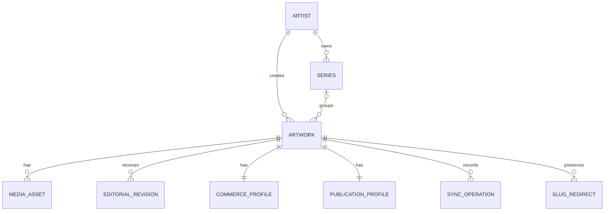
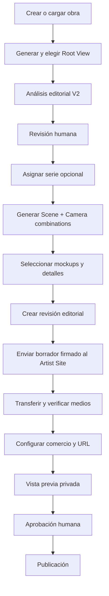

# Especificación de la nueva plataforma ArtworkMockups + Artist Sites

Estado: propuesta para revisión y aprobación  
Fecha: 12 de julio de 2026  
Alcance: arquitectura, producto, procesos, diseño, integración, migración y validación.  
Restricción vigente: este documento no autoriza todavía cambios en las aplicaciones de producción.

## 1. Decisión de producto

Se construirá una nueva versión paralela y limpia de ArtworkMockups y de la integración con sitios de artistas. La plantilla Maurizio será la primera implementación de Artist Site, pero el núcleo deberá poder utilizarse con otros artistas.

La reconstrucción parte de cero en su arquitectura, no en su conocimiento. Debe conservar lo mejor que ya existe:

- análisis editorial V2;
- generación de Root Views;
- Scene Studio y selección de familias ambientales;
- Camera Boards y prompts completos por cámara;
- generación paralela de combinaciones;
- protección de identidad, proporción y escala física de la obra;
- selección y refinamiento de mockups;
- funcionamiento móvil ya calibrado;
- estética premium de Maurizio;
- controles táctiles y firma visual de ArtworkMockups.

Los sistemas actuales permanecerán disponibles como referencia y respaldo durante toda la construcción. La nueva plataforma no leerá ni escribirá sus datos de producción hasta que una fase de migración haya sido aprobada expresamente.

## 2. Principios no negociables

1. La obra de arte es el centro del sistema.
2. Una obra tiene una identidad técnica permanente independiente de su título, archivo o URL.
3. Las series son entidades editoriales de primera clase, pero son opcionales para cada artista.
4. ArtworkMockups es la autoridad editorial y de medios seleccionados.
5. El Artist Site es la autoridad comercial y de publicación pública.
6. Una sincronización nunca publica automáticamente.
7. Una sincronización editorial nunca sobrescribe precio, disponibilidad, ubicación ni decisiones comerciales.
8. Los medios públicos pertenecen al Artist Site; no dependen de URLs temporales de ArtworkMockups.
9. La aplicación nueva se construye en paralelo y admite reversión.
10. La experiencia móvil se diseña junto con escritorio, no como adaptación posterior.
11. La estética de Maurizio se conserva en su sitio; ArtworkMockups conserva su propia firma táctil.
12. No se arrastran rutas legacy, prompts antiguos ni modelos incompatibles solo por compatibilidad histórica.
13. SQLite está prohibido en todos los entornos. La plataforma utilizará MySQL/MariaDB desde desarrollo para preservar concurrencia real, workers y generación paralela.

## 3. Límites de autoridad

### 3.1 ArtworkMockups controla

- identidad de artista y obra en el sistema de origen;
- relación editorial entre obra y serie;
- hechos declarados de la obra;
- análisis editorial aprobado;
- título y texto editorial propuestos;
- Root Artwork seleccionado;
- detalles seleccionados;
- mockups seleccionados y su orden sugerido;
- hashes, dimensiones y procedencia de medios;
- revisión editorial incremental;
- estado y resultado de cada sincronización.

### 3.2 Artist Site controla

- slug y URL pública definitivos;
- visibilidad;
- orden del catálogo y dentro de una serie;
- obra destacada;
- precio y moneda;
- mostrar u ocultar precio;
- estado `available`, `reserved`, `sold`, `not_for_sale` o `archived`;
- modalidad de consulta o venta;
- enlace secundario a una plataforma externa;
- ubicación pública aproximada y presencia en el mapa;
- publicación, despublicación y redirecciones;
- consultas, reservas, pedidos y pagos futuros.

## 4. Modelo conceptual



### 4.1 Artist

Campos mínimos:

- `artist_id`: identificador permanente del sistema;
- `display_name`;
- `site_key`;
- `default_language`;
- `timezone`;
- `series_enabled`;
- `brand_profile_id`;
- `created_at`, `updated_at`.

### 4.2 Series

Las series no serán etiquetas de texto. Serán documentos con identidad propia.

- `source_series_id`, por ejemplo `amw-series:strata`;
- `artist_id`;
- `name`;
- `suggested_slug`;
- `short_description`;
- `long_description`;
- `cover_asset_id`;
- `seo_title`, `seo_description`;
- `keywords`;
- `editorial_revision`;
- `status`: `draft`, `active`, `archived`;
- `suggested_order`.

En el Artist Site existirán además:

- `public_slug`;
- `visibility`;
- `sort_order`;
- `featured`;
- historial de slugs.

Una obra podrá no tener serie. La interfaz no mostrará categorías artificiales como “Sin serie” salvo que el artista lo desee.

### 4.3 Artwork

- `source_artwork_id`, por ejemplo `amw:10002`;
- `artist_id`;
- `source_series_id`, opcional;
- `title`;
- `subtitle`;
- `year`;
- `medium`;
- `materials`;
- dimensiones normalizadas;
- `orientation`;
- `inventory_reference`, opcional y privado;
- `editorial_revision` incremental;
- `analysis_version`;
- `created_at`, `updated_at`.

El título nunca será la clave primaria.

### 4.4 Editorial Revision

Cada sincronización aceptada genera o referencia una revisión inmutable:

- `revision_number`;
- `content_hash`;
- `summary`;
- `concept`;
- `master_description`;
- `short_description`;
- `collector_note`;
- `alt_text`;
- `caption`;
- `keywords`;
- `tags`;
- `language`;
- `analysis_version`;
- `approved_in_artworkmockups_at`;
- `received_at`.

Reglas:

- revisión mayor: se acepta como nuevo borrador;
- misma revisión y mismo hash: replay idempotente;
- misma revisión y hash diferente: conflicto;
- revisión menor: rechazo;
- restauración: operación administrativa explícita, nunca una sincronización ordinaria.

### 4.5 Media Asset

- `asset_id` estable;
- `artwork_id`;
- `kind`: `root`, `detail`, `mockup`, `og`, `thumbnail`;
- `role`: `primary`, `cover`, `context`, `scale`, `detail`;
- `position`;
- `sha256`;
- `mime_type`;
- ancho y alto en píxeles;
- tamaño en bytes;
- `source_revision`;
- `source_url` temporal y autenticada;
- ruta definitiva en el Artist Site;
- estado de transferencia y validación;
- metadatos editoriales propios.

### 4.6 Commerce Profile

Solo existe y se modifica en el Artist Site:

- `status`;
- `price_amount` decimal;
- `currency` ISO 4217;
- `price_visibility`;
- `sale_mode`;
- `inquiry_enabled`;
- `external_listing_url` secundario;
- certificado;
- envío internacional;
- ubicación pública aproximada;
- presencia en mapa;
- historial de cambios.

### 4.7 Publication Profile

- `public_slug`;
- `visibility`: `private`, `unlisted`, `public`;
- `publication_status`: `draft`, `review`, `published`, `archived`;
- `featured`;
- `catalog_sort_order`;
- `series_sort_order`;
- `canonical_url`;
- `published_revision`;
- `published_at`, `unpublished_at`;
- actor que aprobó.

## 5. Flujo de trabajo objetivo



### Estados visibles en ArtworkMockups

- análisis pendiente;
- análisis en revisión;
- editorial aprobado;
- medios sin seleccionar;
- listo para sincronizar;
- enviado;
- recibido por el sitio;
- requiere atención;
- actualización pendiente;
- sincronizado.

### Estados visibles en Artist Site

- recibido;
- transfiriendo medios;
- inválido;
- listo para configuración;
- en revisión;
- privado;
- publicado;
- desactualizado respecto al origen;
- archivado.

## 6. Contrato de sincronización 2.1

El contrato incorporará series y separará operaciones.

```json
{
  "schema_version": "2.1",
  "operation": "upsert_artwork_editorial",
  "request_id": "uuid-v4",
  "idempotency_key": "amw:10002:editorial:8",
  "identity": {
    "source": "artwork_mockups",
    "source_artist_id": "amw-artist:1",
    "source_artwork_id": "amw:10002",
    "editorial_revision": 8,
    "analysis_version": "2"
  },
  "series_ref": {
    "source_series_id": "amw-series:strata",
    "series_revision": 3
  },
  "artwork_facts": {},
  "editorial": {},
  "assets": {
    "root": {},
    "details": [],
    "mockups": []
  }
}
```

Operaciones previstas:

- `upsert_series_editorial`;
- `upsert_artwork_editorial`;
- `validate_artwork_editorial`;
- `archive_artwork_editorial`;
- `get_sync_status`.

El contrato prohíbe expresamente precio, moneda, estado de venta, ubicación de comprador, pedidos y pagos.

## 7. Transporte y seguridad

### Solicitudes editoriales

- HTTPS obligatorio en producción;
- HMAC-SHA256 sobre timestamp y cuerpo exacto;
- secreto por Artist Site;
- soporte para rotación de secreto;
- timestamp con tolerancia limitada;
- `request_id` obligatorio;
- idempotencia persistente;
- límite de tamaño;
- rate limiting;
- códigos de error públicos estables;
- detalle técnico solo en logs privados.

### Transferencia de medios

- URLs temporales firmadas y de corta duración;
- allowlist estricta del host de ArtworkMockups;
- protección SSRF;
- sin redirecciones a redes privadas;
- MIME detectado por contenido;
- SHA-256 obligatorio;
- límite de bytes y dimensiones;
- descarga a temporal único;
- verificación antes de promoción;
- generación local de variantes;
- archivos públicos con nombres internos, no confiados al origen.

## 8. Arquitectura paralela propuesta

La implementación deberá vivir en una aplicación o raíz nueva. Nombre provisional:

```text
artwork-platform-next/
  apps/
    artworkmockups/
    artist-site/
  packages/
    domain/
    sync-contract/
    media-pipeline/
    design-system/
    testing/
  sites/
    maurizio/
  storage/
  docs/
```

La elección final de tecnología se aprobará antes de crear esta estructura. No se introduce un framework solo por modernidad: debe justificarse por seguridad, mantenimiento, pruebas, experiencia del equipo y despliegue disponible.

### Persistencia y concurrencia

- MySQL/MariaDB será el único motor de base de datos admitido en desarrollo, pruebas, staging y producción.
- ArtworkMockups Next y Artist Sites tendrán bases o esquemas separados y usuarios con privilegios mínimos.
- No se incorporará ningún fallback a SQLite.
- Las migraciones serán explícitas, versionadas y ejecutadas antes de iniciar web o workers.
- Las colas usarán filas persistentes, transacciones cortas, reintentos controlados y reclamación segura de trabajos.
- La reserva concurrente de trabajos deberá apoyarse en capacidades de MySQL como `SELECT ... FOR UPDATE SKIP LOCKED` cuando la versión desplegada lo permita.
- Cada job tendrá estado, intento, worker propietario, heartbeat, lease con caducidad e idempotency key.
- Un worker caído no podrá dejar un trabajo bloqueado permanentemente.
- Los artefactos generados no se almacenarán como BLOB en las tablas: la base conservará referencias, hashes, estados y metadatos.
- Las pruebas de integración se ejecutarán contra MySQL/MariaDB real, nunca contra una sustitución en memoria o SQLite.

### Separación funcional

- `domain`: Artist, Series, Artwork, Editorial, Commerce y Publication;
- `sync-contract`: esquemas y firmas compartidas;
- `media-pipeline`: transferencia y derivados;
- `design-system`: tokens y componentes visuales;
- `artworkmockups`: procesos creativos;
- `artist-site`: catálogo y administración comercial;
- `sites/maurizio`: marca, contenido institucional y composición visual propia.

## 9. Sistema visual protegido

### 9.1 Firma ArtworkMockups

Elementos que deben preservarse:

- obra o mockup como superficie dominante;
- controles táctiles superpuestos a la imagen;
- controles mitad dentro y mitad fuera del marco;
- botones cuadrados o de geometría contenida;
- bordes finos y sombras discretas;
- rosa apagado como acento funcional;
- fondos crema y blancos cálidos;
- controles compactos que no ocultan la imagen;
- selección activa mediante subrayado o cambio tonal sobrio;
- sensación de herramienta editorial, no de software corporativo genérico.

Componentes iniciales:

- `ImageStage`;
- `EdgeControlRail`;
- `FloatingModeSelector`;
- `SquarePrimaryAction`;
- `CompactAccordion`;
- `ArtworkCard`;
- `MediaFilmstrip`;
- `GenerationProgress`;
- `MobileBottomAction`.

### 9.2 Identidad Maurizio

Debe conservar:

- tono silencioso y editorial;
- protagonismo de las obras;
- tipografía y ritmo de galería/archivo;
- espacios generosos;
- navegación sobria;
- catálogo por series;
- ausencia de estética de marketplace;
- CTA principal de consulta directa;
- Saatchi Art únicamente como referencia secundaria;
- excelente experiencia móvil.

El sitio Maurizio no copiará la interfaz operativa de ArtworkMockups. Compartirá calidad, precisión y algunos tokens, pero conservará una personalidad pública independiente.

### 9.3 Tokens iniciales a documentar

- paleta funcional y paleta de marca;
- tipografías y escalas;
- espaciado;
- radios y geometrías cuadradas;
- bordes;
- sombras;
- tamaños táctiles mínimos;
- estados hover, focus, pressed y disabled;
- breakpoints;
- proporciones de imagen;
- movimiento reducido y accesibilidad.

## 10. Estrategia móvil

La versión móvil será un criterio de aceptación de cada componente.

- objetivo táctil mínimo de 44 × 44 px;
- acciones primarias accesibles con una mano;
- controles flotantes que no oculten la obra;
- paneles largos convertidos en drawers o acordeones;
- navegación compacta sin duplicar funciones;
- imágenes responsivas y carga progresiva;
- estado preservado al rotar o cambiar de pantalla;
- pruebas en anchos pequeños reales, no solo emulación amplia;
- respeto a safe areas;
- soporte de teclado y foco también en escritorio.

## 11. Páginas objetivo de ArtworkMockups

1. Inicio / estado de trabajo.
2. Create Artwork.
3. Root View Selection.
4. Artwork Review y análisis V2.
5. Series Manager.
6. Scene Studio.
7. Camera Boards.
8. Combination Review.
9. Art Mockups.
10. Mockup Lab.
11. Publication Preparation.
12. Artist Site Sync Status.
13. Artist Profile.
14. Account y conexiones.

## 12. Páginas objetivo del Artist Site Maurizio

### Públicas

- Home;
- Works / catálogo;
- Series;
- detalle de serie;
- detalle de obra;
- Sold Works;
- Artist;
- Artist Statement;
- Studio Process;
- Studio Notes;
- Collectors / Inquiries;
- Contact;
- búsqueda;
- sitemap y feeds sociales.

### Privadas

- bandeja de sincronización;
- diferencias editoriales;
- estado de medios;
- edición comercial;
- orden de catálogo y series;
- vista previa;
- publicación/despublicación;
- redirecciones;
- historial y reversión;
- auditor de correspondencias.

## 13. Migración opcional del material existente

La nueva app puede iniciar vacía. El material anterior se tratará como fuente de importación, nunca como estructura obligatoria.

Clasificación:

- vinculada con certeza;
- coincidencia probable;
- solo Artist Site;
- solo ArtworkMockups;
- duplicado potencial;
- histórico/no publicable;
- conservar solo por archivo o curiosidad.

Los mockups antiguos podrán:

- importarse como medios seleccionados;
- conservarse en un archivo histórico fuera del catálogo;
- descartarse de la nueva app sin eliminar la copia original.

No se inferirá precio, disponibilidad, serie o ubicación sin revisión humana.

## 14. Plan de implementación y puertas de aprobación

### Fase A — Línea base y diseño técnico

Entregables:

- inventario protegido;
- decisión tecnológica;
- estructura del proyecto nuevo;
- amenazas y seguridad;
- contrato 2.1;
- wireframes de flujos críticos;
- catálogo de componentes visuales.

Puerta A: aprobación de arquitectura, tecnología, contrato y wireframes.

### Fase B — Dominio y almacenamiento

Entregables:

- Artist, Series, Artwork y revisiones;
- Commerce y Publication separados;
- migraciones;
- repositorios;
- historial y auditoría;
- pruebas unitarias.

Puerta B: pruebas de separación editorial/comercial y revisión descendente bloqueada.

### Fase C — Integración segura

Entregables:

- emisor y receptor;
- HMAC y rotación;
- idempotencia;
- reintentos;
- estado de sincronización;
- validación contractual.

Puerta C: fixtures completos y pruebas de fallo/replay.

### Fase D — Medios

Entregables:

- selección de assets;
- transferencia segura;
- hashes;
- derivados responsive;
- limpieza de huérfanos;
- trazabilidad.

Puerta D: una obra completa funciona sin depender de medios remotos.

### Fase E — ArtworkMockups Next

Entregables:

- flujo Root → Analysis → Series → Scene → Camera → Mockups;
- diseño táctil protegido;
- generación paralela;
- selección editorial;
- sincronización;
- móvil.

Puerta E: recorrido completo con datos de prueba y comparación con procesos actuales.

### Fase F — Maurizio Next privado

Entregables:

- Admin;
- catálogo por series;
- detalles de obra;
- comercio;
- preview privado;
- SEO y responsive.

Puerta F: aprobación visual, editorial y comercial.

### Fase G — Correspondencia e importación

Entregables:

- auditor automático;
- decisiones humanas;
- importación por lotes aprobados;
- redirecciones;
- informe de discrepancias.

Puerta G: inventario completo sin duplicados no resueltos.

### Fase H — Publicación gradual

Orden:

1. obra privada;
2. obra pública de prueba;
3. una obra por serie;
4. cinco obras;
5. una serie completa;
6. catálogo aprobado.

Puerta H: métricas, logs, SEO, formularios y reversión verificados.

### Fase I — Sustitución y retirada legacy

- cambio de lectura pública;
- ventana de reversión;
- observación;
- retirada de rutas y prompts legacy;
- conservación de backup y herramientas de importación.

Puerta I: cierre firmado de migración.

## 15. Estrategia de pruebas

### Dominio

- obra con y sin serie;
- cambio de serie;
- serie archivada;
- título cambiado con identidad estable;
- revisiones ascendentes, repetidas y descendentes;
- separación editorial/comercial.

### Integración

- firma válida e inválida;
- timestamp vencido;
- replay;
- conflicto de idempotencia;
- payload excesivo;
- campos comerciales prohibidos;
- reintento después de timeout.

### Medios

- hash válido e inválido;
- MIME falso;
- URL no autorizada;
- archivo excesivo;
- imagen corrupta;
- reemplazo;
- limpieza de huérfanos;
- derivados responsive.

### Publicación

- private, unlisted y public;
- available, reserved, sold y archived;
- publicar y despublicar;
- cambio de slug y redirección;
- rollback de revisión;
- sitemap y canonical.

### UX y visual

- comparación visual automatizada;
- controles táctiles en bordes de imagen;
- foco de teclado;
- contraste;
- safe areas;
- móvil pequeño, móvil grande, tablet y escritorio;
- carga lenta y pérdida temporal de red;
- preferencias de movimiento reducido.

### IA y procesos preservados

- snapshots de prompts activos;
- integridad de Root Views;
- catálogo de Camera Boards;
- generación paralela;
- fidelidad de obra;
- escala física;
- selección de Scene;
- no regresión de flujos aprobados.

Las pruebas automáticas deterministas no sustituirán una evaluación visual de resultados generativos. Existirá un conjunto curado de obras de referencia para comparación humana.

## 16. Criterios de finalización total

La nueva plataforma estará terminada cuando:

1. una obra pueda recorrer todo el proceso sin rutas legacy;
2. pueda pertenecer opcionalmente a una serie estable;
3. análisis, escenas, cámaras y mockups conserven el comportamiento aprobado;
4. los medios se transfieran y verifiquen de forma segura;
5. el Artist Site conserve intactos sus datos comerciales al resincronizar;
6. exista preview y aprobación humana antes de publicar;
7. catálogo, series, obra, sitemap, SEO y consultas usen el modelo nuevo;
8. la experiencia móvil y la firma visual estén verificadas;
9. no existan duplicados o correspondencias pendientes en el catálogo migrado;
10. publicación, despublicación y reversión estén probadas;
11. logs, auditoría, backups y documentación operativa estén completos;
12. las rutas antiguas puedan retirarse sin perder funciones ni datos.

## 17. Decisiones pendientes antes de programar

1. Tecnología final de la nueva plataforma.
2. Versión mínima de MySQL/MariaDB, separación de esquemas y estrategia de medios.
3. Monorepo o repositorios separados.
4. Dominio/subdominio de preview.
5. Idiomas iniciales.
6. Si una obra puede pertenecer a más de una serie o solo a una principal.
7. Quién puede aprobar editorial, comercio y publicación.
8. Política de precios visibles.
9. Alcance inicial de reservas o venta directa.
10. Ventana de reversión antes de retirar el legacy.

Hasta aprobar estas decisiones, el trabajo siguiente debe limitarse a prototipos, esquemas, fixtures y pruebas aisladas sin afectar los sistemas actuales.

## 18. Planes, capacidades y propuesta comercial

La integración con Artist Site y redes forma parte de una propuesta avanzada. No debe entregarse accidentalmente como una extensión invisible del producto básico ni mezclarse con el recorrido de un artista que solo necesita crear mockups.

### 18.1 Separar identidad, rol y plan

El sistema distinguirá tres conceptos:

- **Rol**: qué autoridad tiene una persona (`artist`, `team_member`, `platform_admin`).
- **Plan**: qué propuesta comercial tiene contratada la cuenta.
- **Capacidades**: funciones concretas habilitadas por el plan o por una concesión administrativa.

Un artista no cambia de identidad cuando mejora o reduce su plan. Conserva perfil, obras, series, análisis y mockups. Solo cambian las capacidades disponibles.

No deben crearse condicionales dispersos como `if premium` por toda la aplicación. La interfaz y los servicios consultarán capacidades explícitas.

### 18.2 Propuesta inicial de niveles

Los nombres comerciales son provisionales y podrán cambiar sin alterar la arquitectura.

#### Artist / esencial

Pensado para el artista que necesita producir y organizar material visual.

Incluye:

- perfil de artista;
- carga y organización de obras;
- Root Views;
- análisis y metadata;
- Scene Studio simplificado;
- Camera Boards simplificado;
- generación de mockups;
- Mockup Lab;
- álbumes y descarga de material;
- series básicas;
- límites de almacenamiento, créditos y generaciones según la oferta.

No incluye:

- Artist Site administrado;
- sincronización web;
- publicación en website;
- conexiones de redes sociales;
- calendario o distribución multicanal;
- estados comerciales avanzados;
- administración de precios, disponibilidad, mapa o coleccionistas;
- equipo editorial.

La navegación esencial debe ser limpia: las funciones avanzadas no aparecerán como herramientas rotas. Podrá existir una presentación discreta del upgrade en lugares relevantes, pero no una interfaz llena de bloqueos.

#### Artist Connected / profesional

Pensado para artistas que quieren conectar su producción con publicación y distribución.

Incluye todo lo anterior, más:

- sincronización editorial con un Artist Site compatible;
- preparación y vista previa de publicaciones;
- selección de obras y medios para el sitio;
- series editoriales completas;
- estado de sincronización;
- Pinterest y otras conexiones aprobadas;
- borradores sociales;
- publicación con confirmación explícita;
- metadatos específicos por canal;
- historial de distribución;
- límites superiores de créditos, almacenamiento y medios.

La conexión a redes nunca implica publicación automática. Cada acción externa requiere intención y confirmación claras.

#### Artist Studio / premium administrado

Pensado para una propuesta de mayor valor con website, operación comercial y acompañamiento.

Incluye todo lo anterior, más:

- Artist Site completo y alojado;
- dominio y configuración de marca;
- catálogo público y páginas de series;
- administración comercial;
- precio, disponibilidad, reserva y estados de venta;
- orden, destacados y visibilidad;
- SEO técnico, sitemap, Open Graph y datos estructurados;
- redirecciones y preservación de URLs;
- transferencia y optimización de medios;
- integraciones sociales ampliadas;
- equipo o colaboradores con permisos;
- auditoría, historial y reversión;
- soporte, onboarding y migración según contrato;
- capacidades futuras de consulta, reserva o venta directa.

Maurizio corresponde conceptualmente a este nivel premium, aunque la asignación comercial definitiva se decidirá después.

### 18.3 Matriz inicial de capacidades

| Capacidad | Esencial | Connected | Studio |
|---|---:|---:|---:|
| Obras, series y metadata | Sí | Sí | Sí |
| Root Views y análisis V2 | Sí | Sí | Sí |
| Mockups y Mockup Lab | Sí | Sí | Sí |
| Scene/Camera simplificados | Sí | Sí | Sí |
| Límites ampliados | No | Sí | Sí |
| Preparación multicanal | No | Sí | Sí |
| Conexión de redes | No | Sí | Sí |
| Sincronización con website | No | Sí | Sí |
| Artist Site incluido | No | Opcional/compatible | Sí |
| Administración comercial | No | Limitada | Sí |
| Publicación de catálogo | No | Según website conectado | Sí |
| Equipo y permisos | No | Opcional | Sí |
| Migración y soporte avanzado | No | Opcional | Sí |

Esta matriz describe producto, no precios. Créditos, cuotas, dominios, soporte y número de conexiones se definirán en la oferta comercial.

### 18.4 Capacidades técnicas sugeridas

Ejemplos de claves estables:

```text
artworks.manage
series.manage
analysis.v2
mockups.generate
mockups.lab
scenes.basic
cameras.basic
publishing.prepare
artist_site.sync
artist_site.manage_commerce
artist_site.publish
social.connect
social.create_drafts
social.publish
team.manage
audit.view
```

Los planes se traducen a un conjunto de estas capacidades. Excepciones comerciales o pruebas temporales se registran como concesiones con fecha de expiración y motivo.

### 18.5 Modelo de cuenta y suscripción

Entidades adicionales:

- `Account`: propietario comercial de artistas, obras y consumo.
- `Membership`: relación entre usuario y cuenta.
- `Role`: permisos humanos dentro de la cuenta.
- `Plan`: paquete comercial versionado.
- `Subscription`: plan vigente, estado y periodo.
- `Entitlement`: capacidad efectiva.
- `UsageLedger`: créditos, generaciones, almacenamiento y transferencias.
- `SiteConnection`: relación con un Artist Site.
- `SocialConnection`: conexión cifrada y revocable con una red.

Estados de suscripción previstos:

- `trialing`;
- `active`;
- `past_due`;
- `paused`;
- `cancelled`;
- `grace_period`.

La lógica de facturación no debe mezclarse directamente con la generación de imágenes. La generación consulta capacidades y cuota efectiva; el proveedor de pagos actualiza la suscripción mediante eventos idempotentes.

### 18.6 Upgrade y downgrade

Al mejorar el plan:

- se habilitan capacidades;
- aparece el onboarding correspondiente;
- el artista elige si conecta website o redes;
- nada se publica automáticamente.

Al reducir o cancelar:

- no se borran obras, series, metadata ni mockups;
- se deshabilitan nuevas sincronizaciones y publicaciones avanzadas;
- conexiones externas pueden quedar en modo lectura o requerir desconexión;
- el Artist Site publicado sigue una política contractual explícita de gracia, exportación o alojamiento;
- se ofrece exportación de datos y medios cuando corresponda;
- el historial permanece auditable.

La política exacta para dominio, alojamiento y continuidad del Artist Site después de cancelar debe definirse antes de vender el nivel Studio.

### 18.7 Administración de plataforma

El administrador de ArtworkMockups necesitará una consola separada de la experiencia del artista para:

- ver cuentas, artistas y planes;
- conceder o retirar capacidades con trazabilidad;
- revisar consumo y cuotas;
- iniciar onboarding de Artist Site;
- gestionar estado de conexiones sin visualizar secretos;
- observar sincronizaciones y errores;
- suspender una integración comprometida;
- asistir migraciones;
- consultar auditoría;
- nunca publicar contenido del artista sin autorización explícita.

La administración de plataforma no sustituye la administración editorial/comercial privada de cada Artist Site.

### 18.8 Pruebas específicas de planes

- el plan esencial no puede invocar endpoints premium aunque manipule la interfaz;
- ocultar un botón no se considera control de acceso;
- upgrade conserva todos los datos y habilita onboarding;
- downgrade conserva datos y bloquea nuevas acciones avanzadas;
- expiración de una concesión elimina la capacidad efectiva;
- un miembro sin rol suficiente no hereda autoridad del plan;
- límites de uso son transaccionales y resistentes a solicitudes simultáneas;
- webhooks de pago repetidos son idempotentes;
- una cuenta no puede acceder a conexiones, obras o consumo de otra;
- logs y soporte no exponen tokens sociales ni secretos del Artist Site.
