# Inventario de Pantallas y Estados Visuales

Este documento presenta una lista detallada de todas las interfaces del sistema, organizadas en orden de flujo, junto con la evidencia visual correspondiente y su propósito funcional.

---

## 1. Pantalla de Acceso (Login)
*   **Ruta física**: `login.php`
*   **Screenshot**:
    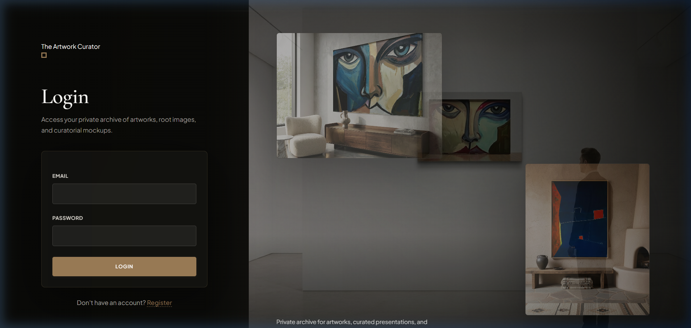
*   **Propósito**: Formulario para la autenticación de usuarios (artistas y administradores). Presenta una grilla visual estética en el panel lateral derecho con mockups curatoriales del archivo privado del artista para crear una atmósfera premium de bienvenida.

---

## 2. Panel Principal (Dashboard)
*   **Ruta física**: `dashboard.php`
*   **Screenshot**:
    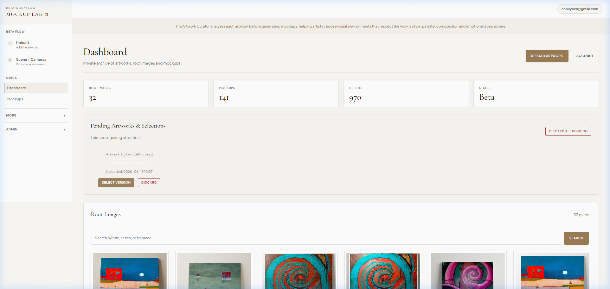
*   **Propósito**: Pantalla central del artista. Muestra el historial completo de obras subidas en una grilla con sus respectivas miniaturas, títulos, estados del proceso (ej. "done") y fecha de última actualización. Permite iniciar el proceso de carga de una nueva obra.

---

## 3. Carga y Creación de Obra (Onboarding / Paso 1)
*   **Ruta física**: `artwork_new.php`
*   **Screenshot**:
    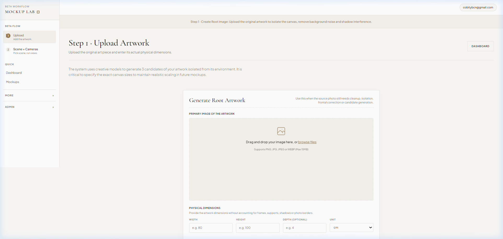
*   **Propósito**: Interfaz dual para iniciar una obra en el sistema. El panel principal izquierdo permite cargar el archivo y procesar la obra frontal mediante IA (Imagen 3) para limpiar bordes. El panel derecho permite hacer un bypass (cargando una foto ya lista), saltando el análisis de Vertex AI. Ambos piden ingresar las dimensiones físicas (ancho, alto, profundidad) de la obra.

---

## 4. Pantalla de Espera (Processing State)
*   **Ruta física**: `waiting.php`
*   **Screenshot**:
    
*   **Propósito**: Estado de carga intermedio cuando se procesa la obra mediante la opción A (limpieza y generación de candidatas frontales con Imagen 3). Muestra una animación de carga sencilla ("simple spinner"), el Job ID del servidor, textos descriptivos del paso actual e información curatorial rotativa para mantener entretenido al artista.

---

## 5. Selección de Perspectiva Frontal (Root Artwork Candidate Select)
*   **Ruta física**: `root_select.php`
*   **Screenshot**:
    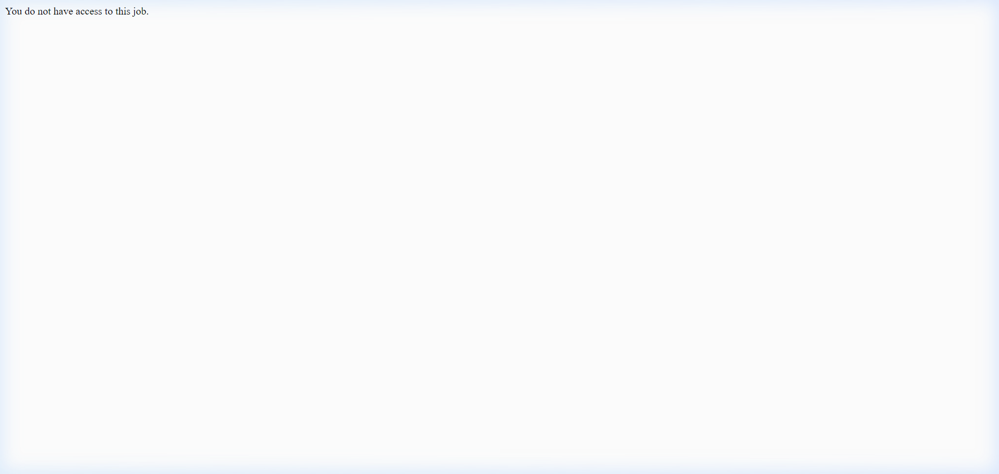
*   **Propósito**: Permite al artista inspeccionar las 3 opciones de aislamiento y corrección de perspectiva generadas por Imagen 3. El panel de la izquierda muestra la referencia original subida por el artista y la derecha permite seleccionar y confirmar cuál es la mejor candidata frontal para usar como base ("root") de los mockups.

---

## 6. Ficha Permanente de la Obra (Artwork Sheet)
*   **Ruta física**: `artwork.php`
*   **Screenshot**:
    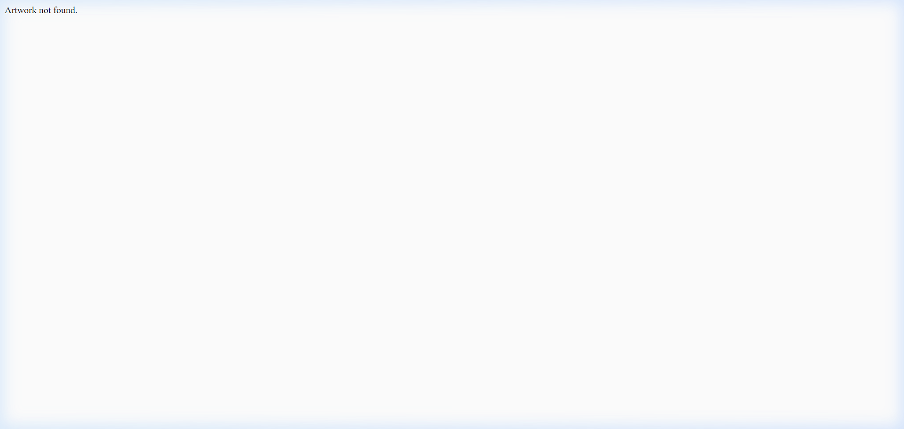
*   **Propósito**: Panel consolidado de la obra terminada. Muestra la imagen root limpia, fichas de títulos alternativos sugeridos por Gemini, lectura curatorial, y permite editar la metadata física (título definitivo, técnica, año, serie). También muestra los mockups generados y da accesibilidad de descarga/copiado de captions y alt tags SEO.

---

## 7. Panel de Revisión del Core (Review Artwork Core)
*   **Ruta física**: `core_review.php`
*   **Screenshot**:
    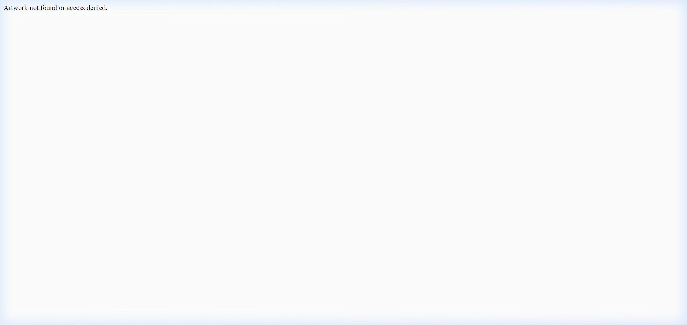
*   **Propósito**: Dashboard técnico de revisión de metadatos estructurales (Core JSON 1.1). Expone el estado de las capturas oblicuas (3/4 izquierda y 3/4 derecha), los detalles de profundidad, terminaciones del canto del bastidor, y los tres ramales de exploración curatoria (Branches 1, 2 y 3) generados por los modelos.

---

## 8. Laboratorio de Mockups (Scene + Cameras)
*   **Ruta física**: `mockup_combinations_review.php`
*   **Screenshot**:
    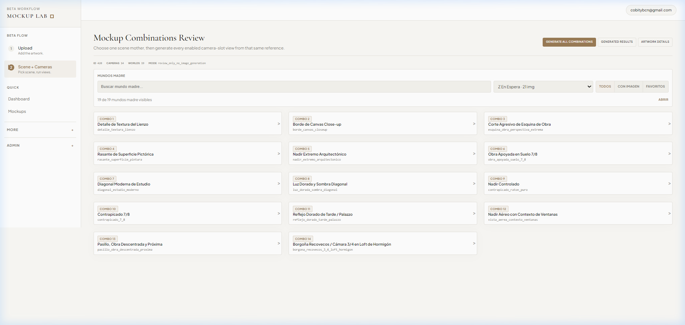
*   **Propósito**: El núcleo de simulación arquitectónica de la plataforma. Permite elegir la escena interior (ej. Living Room, Bedroom), seleccionar de forma interactiva cuáles de los 14 ángulos de cámara fijos habilitados se desean generar, y lanzar la cola de generación con Gemini + Veo para visualizar la obra colgada a escala real.

---

## 9. Generador de Video Secuencial Simple (Social Video)
*   **Ruta física**: `social_video.php` (incluye `social_video_simple.php`)
*   **Screenshot**:
    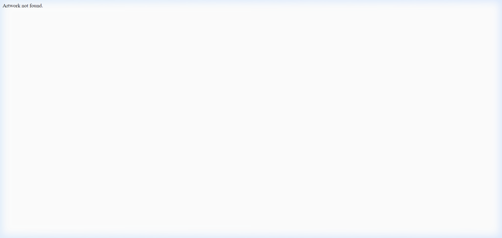
*   **Propósito**: Interfaz simplificada y reordenable mediante arrastre (drag-and-drop) de los mockups generados previamente para esa obra. Permite definir una secuencia y lanzar el proceso local con FFmpeg para renderizar un video en formato vertical (9:16) optimizado para TikTok, Reels o Shorts.

---

## 10. Generador de Video Timeline de 5 Hitos (Video Timeline Experiment)
*   **Ruta física**: `social_video_timeline.php`
*   **Screenshot**:
    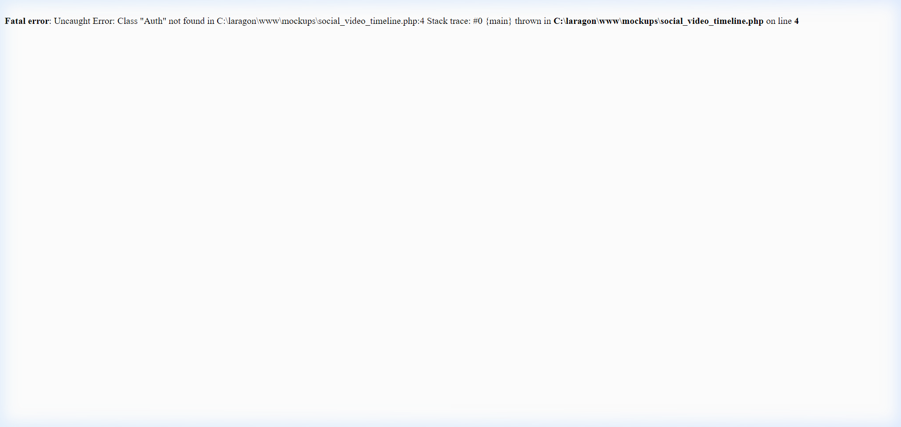
*   **Propósito**: Interfaz experimental que permite construir un video conceptual a partir de una línea de tiempo estructurada en 5 momentos clave (Principio, 3 de Desarrollo, Fin). El artista puede arrastrar mockups del inventario, subir fotos propias o de referencia y redactar el guión literario (narración) que describe la transición.

---

## 11. Configuración de Cuenta y Perfiles

### Perfil Curatorial del Artista
*   **Ruta física**: `artist_profile.php`
*   **Screenshot**:
    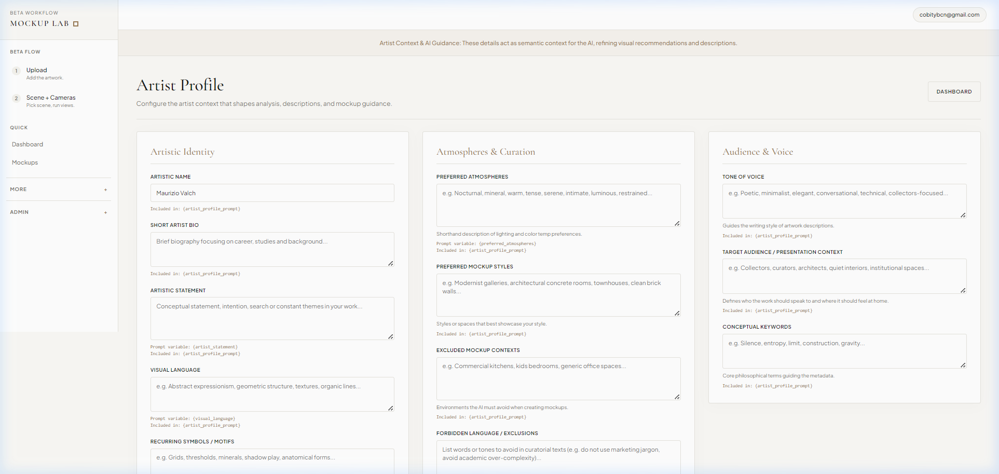
*   **Propósito**: Permite ingresar la biografía, el estilo plástico dominante, las paletas de color y posicionamiento de mercado que Gemini utilizará como contexto para redactar las descripciones curatoriales en la carga de obras.

### Cuenta del Usuario
*   **Ruta física**: `account.php`
*   **Screenshot**:
    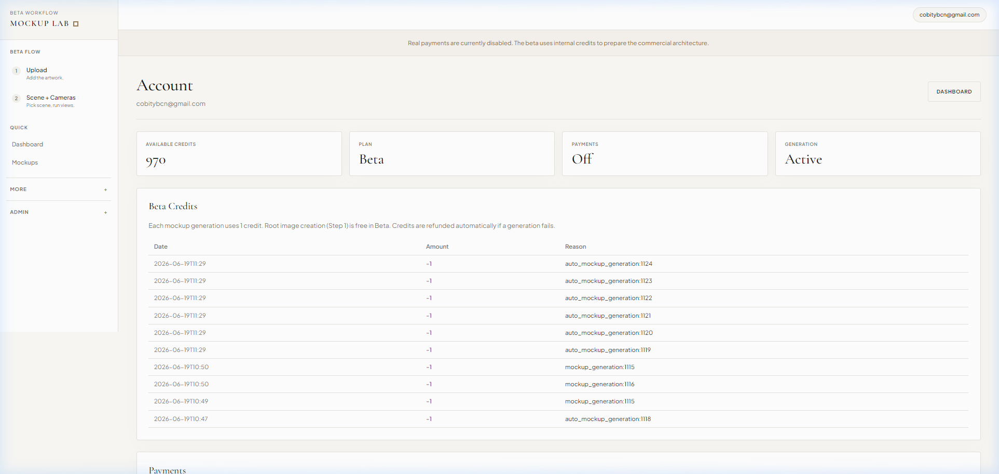
*   **Propósito**: Muestra los datos de la cuenta activa (email, rol) y el saldo actual de créditos del artista necesarios para generar mockups.

---

## 12. Vistas del Administrador (Admin Only)

### Usuarios y Gestión de Créditos
*   **Ruta física**: `admin_users.php`
*   **Screenshot**:
    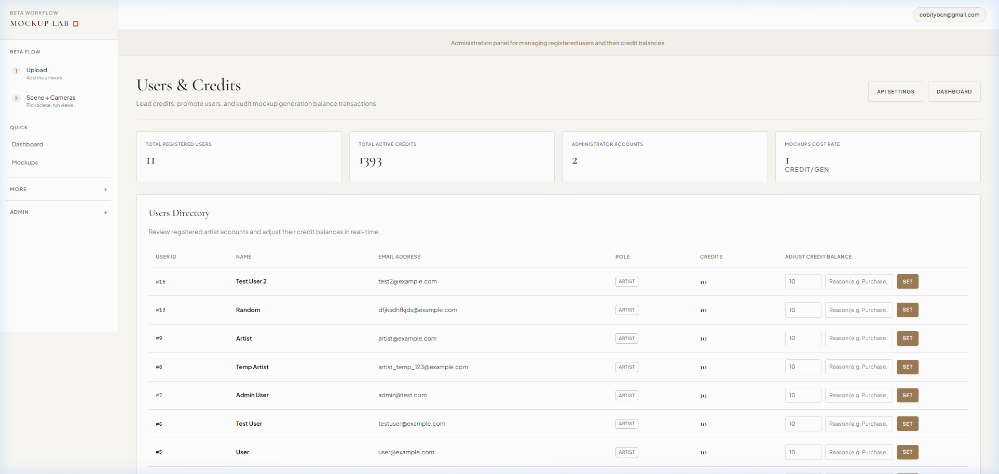
*   **Propósito**: Tabla de administración que permite ver la lista de usuarios, sus roles (ej. Administrador / Artista) y editar directamente su saldo de créditos del sistema.

### Prompts de Sistema
*   **Ruta física**: `admin_prompts.php`
*   **Screenshot**:
    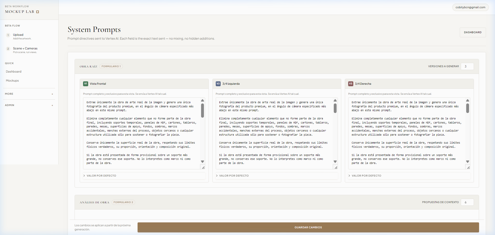
*   **Propósito**: Editor de las plantillas e instrucciones base (System Prompts) que controlan la limpieza de Imagen, el análisis curatorial de Gemini, y la generación de mockups interiores en Vertex AI.

### Ajustes de API y Modelos
*   **Ruta física**: `admin_api_keys.php`
*   **Screenshot**:
    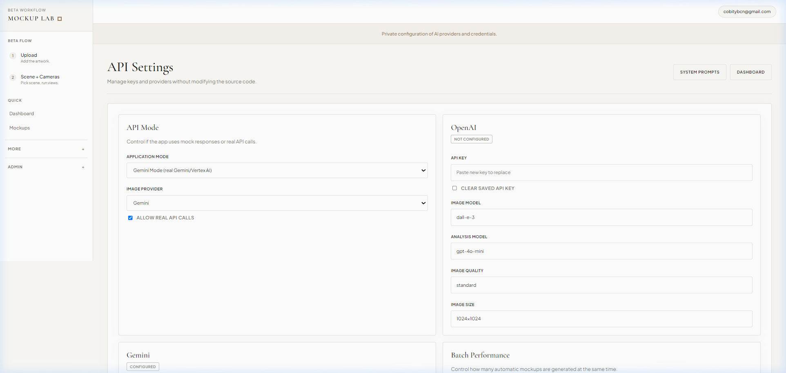
*   **Propósito**: Configuración técnica de los endpoints de Vertex AI, el modelo de Veo Video utilizado, las regiones de Google Cloud y los URIs de almacenamiento de Google Cloud Storage.
